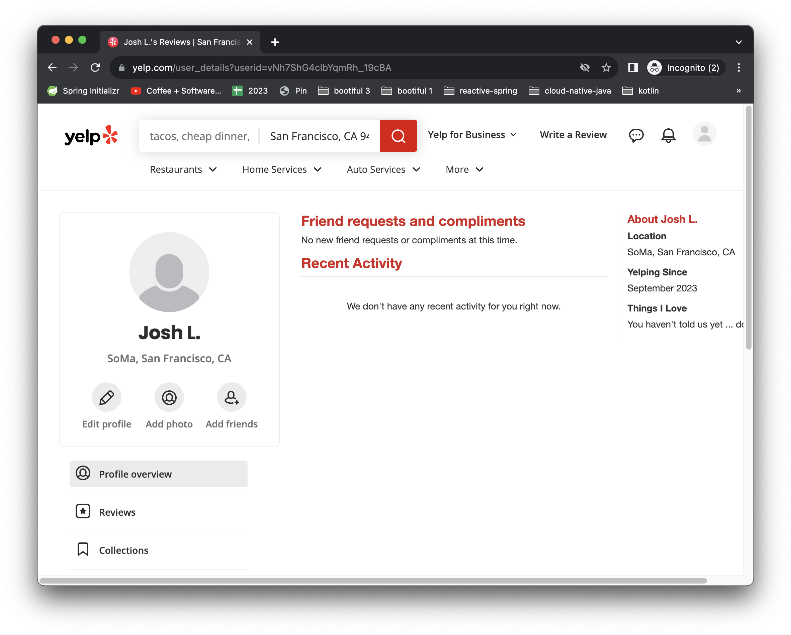

= Authorize All the Things with the Spring Authorization Server, OAuth, and Spring Boot
Josh Long <josh@joshlong.com>
:reproducible:
:listing-caption: Listing
:source-highlighter: rouge
:toc:

{author} loves the Spring Authorization Server, and want you to love it too.
Let's dive right into it.

== Introducing the Spring Authorization Server

Hi, Spring fans!
We're going to look at some patterns and practices for working with the Spring Authorization Server, and with OAuth in general in a Spring Boot-based system.

The Spring Authorization Server is one of my favorite new projects.
It's a full-blown OAuth identity provider (IDP), distributed as Spring Boot autoconfiguration.

The Spring Authorization Server is the final piece in the Spring Security OAuth's Ship of Theseus, the final replacement for a component in the built-in OAuth support in Spring Security 5 and later.
First there was OIDC client support, and then resource server support, and now - after a _lot_ of community outpouring and support - a brand new and fully featured OAuth IDP.

Why not use Keycloak, Okta, Auth0, ActiveDirectory, or something, I hear you ask?
And the answer is.. be our guest! 99% of the stuff we're going to look at here works with any OAuth IDP.
But i do so love the Spring Authorization Server.
I don't know an easier way to get as configurable and flexible IDP up-and-running.

Having an easy component for your IDP integration is _liberating_.
If nothing else, it's one less `users` microservice for you to build.
But, at its best, it's a unifying force for your organization's notions of identity and policy, all centralized.

If you implement it correctly, it's one less `users` microservice for _all_ of your systems, not just the one you're working on now!
You'll have one less bespoke token management system, too.
OAuth offers a very nice opportunity to make your application more efficient and scalable.
In a typical monolithic application, password validation is done in the same node where the rest of the business logic lives.
CPU-intensive encryption will starve the rest of the requests of capacity.
You'll also have outsourced some of the expensive CPU-centric processing that your program will probably have to do a single place in the system, where it can be scaled independently.

It's Spring, so it of course supports the new-and-novel, but it's also built like all Spring Boot autoconfiguration, with hooks and customization in mind at every step.

I love it and I love it for helping me to love OAuth.
If you only knew the agony I've been subjected to in learning and welding OAuth over the years, then you'll know what a thing that is for me to say.
And I want you, dear reader, to love OAuth.
And the way to do that is to, basically, _not_ care about OAuth.

And so we're going to take a journey to production together, with the Spring Authorization Server at our backs, and learn how to wield OAuth (via the amazing Spring Authorization Server) for some common kinds of patterns.

== The Journey Ahead

We're going to do a breadth-first not depth-first approach to using the Spring Authorization Server, so we're going to look at several pieces.
By the end of this, we'll have explored:

* a Spring Authorization Server instance (called `authorization-server`)
* a backend HTTP API protected by Spring Security's OAuth 2 Resource Server capability (called `api`)
* a headless RabbitMQ-powered microservice whose request handling is done with Spring Integration, and protected by Spring Security's OAuth 2 Resource Server capability, _sort of_. (called `processor`)
* a static JavaScript application.
I hesitate to even call it an application.
It's one page, `index.html` (called `static`)
* a Spring Cloud Gateway instance that's acting as an OAuth 2 token relay and OAuth 2 client, originating new OAuth 2 tokens if they're not present and then forwarding requests onward to the backend HTTP API and static JavaScript assets with the token in tow.

We'll start first with the main event, the Spring Authorization Server.
Arguably, everything _after_ that section would work equally well with any other OAuth 2 identity provider (IDP).
But maybe you'll see in reading this section that you don't _need_ any other OAuth 2 identity provider any more.
Either way, read on!

== Try it out!

Now, before we get ahead of ourselves, let's try it out!
Grab (`git clone`) the https://github.com/spring-tips/spring-authorization-server[code here] to follow along.

* in the root folder of the code, run `docker compose up`
* in `authorization-service`, run `run.sh`
* in `gateway`, run `run.sh`
* in `api`, run `run.sh`
* in `processor`, run `run.sh`
* in `static`, run `run.sh`
* visit `http://127.0.0.1:8082` (important: use the IP, _not_ `localhost`!) in the browser.
* login with `jlong`/`password` (yes, I know it's a terrible password, don't `@` me!), and then consent when prompted.
* you'll see a list of customers, click on the `email` button to kick off work in the `processor`.
You should see indications in the console that your message has been sent.

There are lots of moving parts, but here's what you need to know: we have a JavaScript/HTML 5 client, a backend HTTP API, and a headless backoffice process, all of which have been secured with the Spring Authorization Server.

Shut everything down, and we'll start from scratch.

Refreshingly simple.
Let's dive right into the nitty-gritty.
I want you building secure systems by the article's end.
My goal here is not to cover _every_ possible use case, but to cover some of the typical use-cases and introduce progressively more moving parts so that, if at some point you don't see what you need, you know where to reach you to build it yourself.

== Docker Compose and our Middleware

I know I just told you to shut everything down, but you need to restart one thing: the Docker images for both PostgreSQL and RabbitMQ.
I've described all of their configuration in a `docker-compose.yml` file in the root of this project.
It looks like this.

[source,yaml]
-----
include::docker-compose.yml[]
-----

We'll be connecting to either or both of the Docker images across many different services, so let's start them up before we proceed.

Go to the root of the project.

[source,shell]
----
docker compose up
----

RabbitMQ will be running on the usual port and have a user, `user`, and a password, `password`.
PostgresSQL will be running on the usual port with the user `postgres`, schema called `postgres`, and the password `postgres`.
Yes, I know these are terrible passwords...

== Stand up a Spring Authorization Server Instance for Great Good

Go to the https://start.spring.io[Spring Initializr (start.spring.io)], specify a group ID and an artifact ID (I chose `bootiful` : `authorization-server`) and add  `OAuth2 Authorization Server` as a dependency.
I'd add `GraalVM Native Support` for good measure, but you do you.
Open the downloaded project in your IDE.
I'm using IntelliJ IDEA, but again, you do you.
I ran the following command from the root of the newly unzipped archive: `idea build.gradle`.

You've got a new Spring Boot Authorization Server.
We need to specify two things: *users*, and *clients*.

=== Users

Users are pretty straight forward, right?
A user is the sum of the username, password, and associated information attached to the systems' notion of identity.
The beating heart of our system.

There are a lot of ways to get this done.
The easiest might be to just have one user, the _default_ user, which you can describe using Spring Boot's associated properties, like this:

[source,properties]
----
include::authorization-server/snippets/default-user.properties[]
----

This gets us off the ground, but as soon as you want two or more users, you'll need to specify them a different way.
The easiest is probably to define a bean of type   `InMemoryUserDetailsManager`, like this.

[code,java]
----
include::./authorization-server/snippets/UserDetailsConfiguration.java[]
----

Thus configured we've got two users:

* `jlong` with password `password` and roles `USER`
* `rwinch` with password `p@ssw0rd` and roles `USER` and `ADMIN`

This implementation is fine for development as it's all in-memory.
In a production system, you'll probably want something more durable.
We'll look at those possibilities in a bit.

=== OAuth Clients

An OAuth client defines how a program or process interacts with an OAuth IDP (like Spring Authorization Server).
Clients correspond more or less to the programs that would like to be allowed to authenticate on behalf of users.

I have tried to conceive of a clear illustration of clients in a vacuum, but it's not easy. so let's examine a real life example: you stumble upon some website, say https://www.yelp.com/[Yelp], a website that lets you contribute and read reviews about locations - restaurants, businesses, tourist spots, etc.
You want to login to see your history.
You _could_ create a new account there, going through the whole sign up flow and entering redundant information, but this information could soon become stale.
Maybe you change house or email address, or whatever, and you've forgotten to go back to the site and change your information.
Yelp know this, so they offer another path forward: `Continue with Google` and `Continue with Apple`.

Click the button and another window on Google or Apple's sites pop up.

You know what to do here: you're in familiar territory.
It's google.com!
You know Google.
And Google _definitely_  knows you!
You've got an account here, you maintain that account, and you like that account.
You use it for your daily email, after all.
You've even got that reassuring little padlock icon in the browser's location bar giving you the warm-n-fuzzies about this site's authenticity: it is who it claims to be.
So you enter your information, login, and you have to whatever mutli-factor auth things Google wants you to do.

This shows up as a prompt on a completely different device, an iPad.

You've approved of the login, so that Google knows it really is you logging in, and now it's got to make sure you realize you're handing over some of the data associated with your identity to this new website, Yelp.com, so it throws up a consent form.

You click `Confirm` and then are finally logged in, with your Google identity, on Yelp.com

At the end of this dance, Google.com transmitted a _token_ to the application running at Yelp.com.
Armed with this, the application running at Yelp.com can now transmit requests to the Google.com APIs, asking it questions about you, like your email.
It might also be able to read your Google calendar events, location data, etc.
What precisely the application at Yelp.com has access to is a function of the _scopes_ requested by the client.
The application at Yelp.com stores the token and uses it to interact with Google on your behalf.
Occasionally, Google.com will expire the token.
Tokens, like milk, go stale!
No worries: the application at Yelp.com has a _refresh_ token it can use to refresh the token and get a new one.

You're glad you signed up at Yelp.com, but look at the time!
It's noon, the sun's out and the kid wants to go play mini golf at the place you just found on Yelp.com.
Gotta go!

Time passes, and you return to Yelp.com a week later.
By this point, Yelp.com's expired your HTTP session, and you're logged out.
No problem.
Click the `Continue with Google` button again, and this time you'll just be dumped into Yelp.com, fully authenticated.
Both Google and Yelp remember who you are and so there's no ceremony this time.
You got fast-path'd into an authenticated HTTP session on Yelp.com.
Thus: OAuth is invaluable both for establishing a new account and for subsequently logging into it.
You may have changed your home address on Google.com in the meantime, and now Yelp.com can see the new address information and offer you updated recommendations, too.
So Yelp.com is kept up-to-date and all you had to do was keep Google.com up-to-date.

From the perspective of Google, Yelp.com is an OAuth client.
All the particulars of how you went through that authentication flow - whether you needed to be redirected to Google.com, whether you should be shown a consent form, and what data Yelp.com was allowed to read from the Google.com API once it had a token stemming from this authentication flow, was governed by how the developers at Yelp.com registered their client with Google.

Clients must stipulate a client ID, and a client secret.
The client Id and client secret are transmitted in the request initiating the authentication flow, signalling to Google that Yelp.com is making this request.
Clients also stipulate what _scopes_ they want.
A scope is OAuth's version of rights, permissions, authorities, or claims.
They're (basically) arbitrary strings that mean something to Google.com's API.

There is one scope, `openid`, which is part of the OIDC specification.
This scope means that you want to log in as a user with the OAuth flow.
This is a sort of special case; Yelp.com may not want to read Google Calendar data, or read your email.
Those scopes would necessarily be unique to Google's APIs.
But signing a user into a site is a common enough thing and one that can be implemented usefully across all sorts of OAuth providers, so there's a specification called OpenID Connect (OIDC), that builds on top of OAuth 2.0, prescribing standard scopes and , importantly, standard APIs by which a client may look up information associated with a user.
Yelp.com might only just need enough information from Google.com to fill out a signup form for us: name, email, etc.
In that case, it would just specify `openid` as a scope and call it good.
In this way the Yelp.com client could even reuse the same code across other OIDC compliant providers, changing only the client ID and client secret and the issuer URI (the API's root URL).
Neat-o!

So, if you built a backoffice process, you'd register a client for that backoffice process.
If you built a new web application that you intend to support automatic sign-in with OAuth, you'd register a new client for that web application.

The simplest way to register clients in the Spring Authorization Server is to use properties in the `application.properties` or `application.yaml` file, like in this `application.yaml` example:

[source,yaml]
----
include::authorization-server/snippets/registered-clients.yaml[]
----

<1> you can use the https://docs.spring.io/spring-boot/docs/current/reference/html/cli.html[`spring`] CLI to encode a password for the client secret: `spring encodepassword BLAH`, where `BLAH` is the string you want to encode.
In our case, the client ID is `crm` and the client secret is `crm`.
(Again, I _know_ it's a terrible password.
Don't `@` me!).
NB: For complex strings like this, YAML parsing rules can be problematic, so I tend to wrap these things in quotation marks.
<2> `authorization-grant-types` refers to the use case - web application, mobile, headless backoffice application, etc. - for the authentication flow. https://oauth.net/2/grant-types/[OAuth 2.0 is nothing if not flexible].
<3> we're building a web application so the expectation is that, once you've authenticated yourself with the Spring Authorization Server, it'll redirect you back to the web application with the token in tow.
But where?
You specify that here.
We haven't looked at the application yet, so this is a bit of foreshadowing, but the redirect URI specified here is designed to line up with Spring Security's OAuth client support, which we'll use on the web application.
<4> Here we specify which scopes we'd like to be given.
We've seen `openid` before, and the other two are arbitrary, and just for demonstration.

At this point, we have a valid Spring Authorization Server, and you're ready to start using it!
Run the application in the usual way: `./gradlew bootRun` or `./mvnw spring-boot:run` or just run the main method from your IDE.
Congratulations on your first deployment of the Spring Authorization Server.
We _could_ stop here, satisfied that we have got _something_ to allow us to handle development chores and start building services.
Indeed, if you want to, you can skip ahead and things should work fine.

Eventually, however, you're going to realize you can't leave things as they are - you'll need durable state.
As-is, everything is kept in-memory.
It's obviously non-starter to need to deploy a new Spring Authorization Server every time you add a new client, user, or otherwise.
People will want self-service forms by which they can register new users, clients, etc.
All existing OAuth tokens would become invalid once you restart the Spring Authorization Server, too!
Indeed, all state related to any successful OAuth authorizations would be forgotten on every restart.
The situation's not good, and in the next section, we're going to look at introducing persistence, with JDBC, to get around it.

If you want to carry on using property files, then perhaps consider the Spring Cloud Config Server.
It's another piece of Spring Boot-powered middleware that, once stood up, mediates access to configuration files via an HTTP API.
The configuration files live in a version control system, like Git, which the Spring Cloud Config Server monitors.
When the files change, the Spring Cloud Config Server serves up the new configuration data.
Even better, the Spring Cloud Config Server can, via the Spring Cloud Bus abstraction, publish notifications to your microservices (like the Spring Authorization Server) on an event bus like RabbitMQ or Apache Kafka so that you can automatically reload the new configuration.
This works particularly well in tandem with the Spring Cloud's `@RefreshScope`.
In such a configuration, the configuration for everything still lives in a `.properties` or `.yaml` file, as it does now, but the files are centralized and can be changed without reloading the Spring Authorization Server.
Storing files in a version control system gives us niceties like versioning, auditing, rollbacks, etc., for very sensitive configuration data.
And, going a step further, you can even use the Spring Authorization Server to store data encrypted at rest.
For more on these possibilities, check out this https://www.youtube.com/watch?v=aC_siBP8rx8&list=PLgGXSWYM2FpPw8rV0tZoMiJYSCiLhPnOc&index=31[video I did some years ago].
And _all_ of these possibilities are enabled entirely because the Spring Authorization Server is delivered as just another Spring Boot autoconfiguration!

== Persistent State in the Spring Authorization Server with PostgreSQL and JDBC

Spring makes it easy to substitute implementations with polymorphism.  _Dependency injection_ is one of the key reasons we use Spring.
Spring Boot-based configuration makes this doubly powerful.
While the Spring Authorization Server does amazing things out of the box, its real power lay in all the knobs and leavers available to you because it's just another Spring Boot autoconfiguration.
We have already acknowledged that keys parts of the Spring Authorization Server defer to in-memory implementations.
In this section, we'll swap those, and more, out for implementations using JDBC.
We'll use JDBC, but these are just interfaces.
If you don't want to use JDBC, then feel free to implement the interfaces for yourself, deferring to whatever underlying storage mechanism you want.
Spring Data is your friend...

Before we can get started, we'll need a PostgreSQL database.
Some place in which to store our state.
In the root of the project, run `docker compose up`.

Now, we're going to need to retool our project to accomodate JDBC, so add the following dependencies to the Gradle build:

[source,groovy]
----
	runtimeOnly 'org.postgresql:postgresql'
	implementation 'org.springframework.boot:spring-boot-starter-jdbc'
----

Modify `application.properties` or `application.yaml` to point to the newly configured PostgreSQL database with username, schema, and password all set to `postgres`.
(Sigh.
I can feel Spring Security lead Rob Winch staring at me disapprovingly because of my terribad passwords: I'm trying to demonstrate something here!) Here's the relevant configuration for `application.properties`.

[source,properties]
----
spring.datasource.url=jdbc:postgresql://localhost/postgres
spring.datasource.username=postgres
spring.datasource.password=postgres
# <1>
spring.sql.init.mode=always
# <2>
spring.sql.init.schema-locations=classpath:sql/schema/*sql
# <3>
# spring.sql.init.data-locations=classpath:sql/data/*sql
----

<1> This tells Spring Boot to initialize the SQL database with the schema in `src/main/resources/schema.sql` and `src/main/resources/data.sql`.
Be sure to disable this property in production!
<2> This tells Spring Boot to not use `schema.sql` specifically, but to instead use _all_ `.sql` files in `src/main/resources/sql/schema/`.
This way, we can keep the various DDL statements separate.
<3> If enabled, this line tells Spring Boot to not use `data.sql` specifically, but to instead use _all_ `.sql` files in `src/main/resources/sql/data/`.
This way, we can keep the inserts separate.
Make sure to create this directory if you enable this property.

=== A Brief Note on Storing Credentials

Every time you see a password, or any kind of credential like a key, in the source code of these programs, remember, this is a _demonstration_.
There are a million ways to externalize credentials from the source code, and you should use one of them!

It's essential to keep credentials both secure and accessible for the applications that need them, without risking exposure.
Here are some methods and tools to store and make private keys accessible to a Spring Boot application:

* **Environment Variables**: One of the most common ways is to use environment variables to store sensitive data.
These variables can be set on the system where your application runs.
This method separates configuration from the application, but it's not the most secure method on its own, especially if multiple applications share the environment.
* **Java's KeyStore (JKS/JCEKS)**: Java provides its built-in mechanism for securely storing cryptographic keys and certificates - Java KeyStore.
* **AWS Secrets Manager or AWS Parameter Store**: If you are deploying on AWS, you can use these services to store and retrieve your application secrets.
* **HashiCorp Vault**: An open-source tool for secret management.
It allows you to centrally store, access, and deploy secrets across applications and infrastructure.
* **Azure Key Vault**: If you are on Azure, you can use Azure Key Vault to store, manage, and access secrets.
* **Google Cloud Secret Manager**: For applications deployed on GCP.
* **Encrypted Configuration Files**: Use tools like Jasypt with Spring Boot.
Jasypt provides Spring Boot integration and allows you to encrypt property values in your configuration files.
* **Kubernetes Secrets**: If you are deploying your application in Kubernetes, it offers its own secrets management mechanism.
Though it is better than plain config maps (`ConfigMap`), Kubernetes Secrets are Base64 encoded by default and not encrypted.
For enhanced security, consider integrating with external secrets managers like HashiCorp Vault.
* **Dedicated Hardware Security Modules (HSMs)**: These are physical devices that safeguard and manage digital keys, perform encryption and decryption.
Cloud providers like AWS offer their own cloud HSM services.
* **Use Configuration Servers**: For example, Spring Cloud Config Server.
Though not a secrets manager _per se_, when combined with encryption, it can serve configurations securely to your applications.

Always encrypt sensitive data in transit and at rest.
Rotate secrets regularly.
Use IAM roles, policies, and least privilege principles to restrict who can access secrets.
Monitor and audit access to secrets.
Avoid hardcoding secrets or placing them in a version control system (VCS), even if encrypted.
Backup your secrets, but ensure backups are also secured.
No matter which approach you choose, it's essential to keep the principle of least privilege in mind.
Only the necessary entities should have access to your secrets, and they should only be decrypted at the last possible moment (e.g., by the application when needed).

Also, we're going to need to encode passwords so that they're not lying around at rest in plain text.
Define a bean of type `PasswordEncoder` for use in your program.

[source,java]
-----
include::authorization-server/src/main/java/bootiful/authorizationserver/SecurityConfiguration.java[]
-----

<1> this is a sort of compose `PasswordEncoder`, checking the prefix of the password string for information as to which encoder to use.
We've already seen it action.
The `spring encodepassword`  CLI command produces a string that starts with `{bcrypt}...`.
The default for Spring Security, today, as of this writing, is to use BCrypt.
But that may change, and when the default changes, existing passwords will continue to work because the `PasswordEncoder` will know to look for the prefix and use the older BCrypt encoder when dealing with those older passwords.

We'll use the `PasswordEncoder` more later.

=== Persisting Users

There are other implementations of the `UserDetailsService` interface that you can use to persist users durably.
Thinking from a more operational perspective, it's possible you'd want to dynamically register users dynamically, rather than having to restart the Spring Authorization Server instance after you've updated the source code.
Spring Security has an extension of the `UserDetailsService` interface called `UserDetailsManager` which gives you explicit control over the lifecycle of `UserDetails`: adding, updating, deleting, etc.
And, as you might imagine, there's a persistent implementation of this interface called `JdbcUserDetailsManager` that uses JDBC.

You'll need to install some SQL schema first.
Spring Security ships with some usable schema on the classpath, but unfortunately it doesn't work with PostgreSQL, and it's going to fail if there are already table definitions.
So we'll modify it accordingly, as shown in `src/main/resources/sql/schema/users.sql`.

[source,sql]
-----
include::authorization-server/src/main/resources/sql/schema/users.sql[]
-----

We could also define the users with SQL in a file under the `sql/data/` folder, but I want you to see what it looks like to use the Java API to programmatically register a user, so here is both the `UserDetailsService` registration and a bean that uses the `UserDetailsService` to write some data to the database.

[source,java]
-----
include::authorization-server/src/main/java/bootiful/authorizationserver/UsersConfiguration.java[]
-----

<1> this is a convenient pattern: define the prototype for all new users once and then reuse the builder
<2> Poor Rob Winch's eyes! why are there passwords just strewn about our Java source code?
Remember what we talked about earlier: don't do this in production code!

=== Persisting Clients

The `RegisteredClientRepository` interface is trivial and lends itself to implementation with a persistent store.
It's easy enough to do that here, too, with implementations of the `RegisteredClientRepository`.
There's an implementation called `JdbcRegisteredClientRepository` that uses JDBC to manage registered clients.
It would be a fairly trivial project to implement alternatives using other persistence mechanisms like MongoDB or Hashicorp Vault.

The obvious advantage of a `RegisteredClientRepository` backed by a persistent store is that you could build a self-service registration form (or workflow) - just like Google and Apple do - for your organizations developers to register clients on demand without having to restart anything or manipulate source code.

There's some schema on the classpath (`classpath:org/springframework/security/oauth2/server/authorization/client/oauth2-registered-client-schema.sql`) for the implementation that we need to take care to install first.
We could tell Spring Boot to run this directly, but the trouble is that it'll fail on the second run when it executes the same DDL statements and experiences a conflict trying to create something that's already there.
Create a new file `src/main/resources/sql/schema/oauth2-registered-client.sql` and use this DDL instead.

[source,sql]
----
include::authorization-server/src/main/resources/sql/schema/oauth2-registered-client.sql[]
----

And here's the definition of the `RegisteredClientRepository` and a runner that uses it to install a client, more or less identical to the client we registered earlier in `application.properties`.

[source,java]
-----
include::authorization-server/src/main/java/bootiful/authorizationserver/ClientsConfiguration.java[]
-----

<1> register the `RegisteredClientRepository`
<2> this installs a registered client that's more or less equivalent to what we saw earlier in the `application.yml` properties file.

=== Persisting Authorizations

Remember that bit where you got redirected to the Spring Authorization Server and had to click a checkbox to confirm that the user had `user.read` scope?
That fact - the consent of the scope - is stored in memory by default, but it could be stored in a database too.
(Big surprise, I know!)

There are two interfaces of note here: `OAuth2AuthorizationService` and `OAuth2AuthorizationConsentService`.

`OAuth2AuthorizationService` handles representations of an authorization - the JWT token, the client, etc.
It's the same story as before: there's schema on the classpath (`org/springframework/security/oauth2/server/authorization/oauth2-authorization-schema.sql`) but it doesn't work with PostgresSQL and, importantly, even if it did it would fail on the second run through because Spring Boot would try to define the table twice, in effect.
So we'll modify it.
Create a file `src/main/resources/sql/schema/oauth2-authorization-schema.sql`.
The changes we've made replace all `blob` types with `text`.

[source,sql]
-----
include::authorization-server/src/main/resources/sql/schema/oauth2-authorization-schema.sql[]
-----

`OAuth2AuthorizationConsentService` handles representations of an OAuth 2.0 "consent" to an Authorization request, which holds state related to the set of authorities granted to a client by the resource owner.
It's the same story as before: there's schema on the classpath (`org/springframework/security/oauth2/server/authorization/oauth2-authorization-consent-schema.sql`) but it doesn't work with PostgresSQL and, importantly, even if it did it would fail on the second run through because Spring Boot would try to define the table twice, in effect.
So we'll modify it.
Create a file `src/main/resources/sql/schema/oauth2-authorization-consent-schema.sql`.
The changes we've made replace all `blob` types with `text`.

[source,sql]
-----
include::authorization-server/src/main/resources/sql/schema/oauth2-authorization-consent-schema.sql[]
-----

=== Persisting the HTTP Sessions Themselves

The final piece of the persistence pie is to persist the actual HTTP sessions themselves.
Spring Authorization Server assumes a Servlet container is present somewhere.
By default, Spring Boot uses Apache Tomcat, though that's very configurable.
And Apache Tomcat, in turn, provides session management features consistent with the HTTP Servlet specification.
It's even got pluggable HTTP session management, meaning you can plugin other implementations of Apache Tomcat's proprietary abstraction.
But this isn't easy, or portable.
Indeed, any web server is going to have some rudimentary HTTP session management, but session clustering and replication, consistency checks, etc., are not their _raison d'être: serving HTTP requests is.

Spring Session can help.
It wraps the containers' default `HttpSession`.
All interactions you have pass through the wrapper, which in turn delegates to any of a number of implementations backed by technology that is far faster and more reliable in the ways of making data consistently available.You can use implementations for, among other things, Hazelcast, Redis, and of course any 'ol SQL `DataSource`.
We're choosing to continue to leverage our investment in PostgreSQL, so we'll use the Spring Session JDBC module.

Add the following dependency to the build:

[source,groovy]
----
	implementation 'org.springframework.session:spring-session-jdbc'
----

There is a property, `spring.session.jdbc.initialize-schema=always`, that once specified will cause Spring Session to install the JDBC schema for you in the database.
It worked for me (surprise!), in PostgreSQL.
But, I just really want the schema to all be in one place where I can version control it, audit it, etc, so here's the schema.
Create a file `src/main/resources/sql/schema/spring-session-jdbc.sql`.

[source,sql]
-----
include::authorization-server/src/main/resources/sql/schema/spring-session-jdbc.sql[]
-----

We've looked at how to persist almost all aspect of the domain of the Spring Authorization Server with JDBC.
All aspects, except _keys_.
Keys require a long discussion and so in the next chapter we'll look into that.

== Keys

Every time the Spring Authorization Server starts up, the Spring Boot autoconfiguration kicks in generating new keys for our application.
It uses the keys to sign the JWT tokens that it vends for our other applications.
Other applications - clients, microservices, etc. - retain these tokens, sometimes for hours or days or even weeks!
What happens when you restart the Spring Authorization Server, it autocreates new keys, and then a client with a JWT signed with the old keys tries to connect?
It fails!
Having the Spring Authorization Server generate random tokens on every restart can be quite a boon to getting started, but we should furnish our own, stable key if we want the JWTs to survive restarts.
And load balancing, for that matter!
After all, each instance of the JVM would, by default, have different keys.
We're going to add two new files, a private and a public key, and use that to create a `JWKSource<SecurityContext>`.

Generate a key pair.
You'll need `openssl` or `ssh-keygen` installed.

[source,shell]
----
# <1>
openssl genpkey -algorithm RSA -out private_key.pem
openssl pkcs8 -topk8 -inform PEM -outform PEM -in private_key.pem -out private_key_pkcs8.pem -nocrypt
openssl rsa -pubout -in private_key_pkcs8.pem -out public_key.pem
mv private_key.pem app.key
mv public_key.pem app.pub
# <2>
openssl req -new -x509 -key private_key_pkcs8.pem -out cert.pem -days 365
----

<1> make sure you execute all the following commands in a new, empty directory.
It's important that some of the generated files aren't lost in the wildnerness of whatever busy folder you happen to have created them.
<2> this command exports a self-signed certificate (valid for 365 days) that you could (optionally) use if you wanted to store the file in the Java KeyStore as a PKCS13 file.

You'll get two artifacts, `app.pub` and `app.key`.
Copy them both, the private and public key, to the `src/main/resources` folder: the private key should be called `app.key`, and the public key should be called `app.pub`.

I created three (arbitrary) properties in `application.properties` to describe these keys and assign them an ID.

[source,properties]
----
jwt.key.id=bootiful-jwt-key-1
jwt.key.private=classpath:app.key
jwt.key.public=classpath:app.pub
----

We'll use the properties when we define the `JwkSource<ServerContext>` bean.

[source,java]
----
include::authorization-server/snippets/SimpleKeyConfiguration.java[]
----

In this example, I've kept the private key (`app.key`) in the source code of this repository, but as you can imagine, this is a **very bad** idea in production.
Don't forget my admonition earlier: take care to handle your credentials securely.
There are some solid options, including Hashicorp Vault, your favorite hyperscaler cloud's secrets management tools, Lastpass, etc.
If you need it available for this program, it should be passed into the application in such a way that it's very difficult for others to lay hands on it.
Perhaps as environment variable in your application's process space?
Or as an encrypted file that can only be decrypted with a rotating key?
Rotating keys... that brings up one more thing we should cover!

=== Rotating Keys

In the last example we plugged in a fixed key we generated by hand using `openssl`.
It works, for now, but what happens when we need to rotate the keys?
Rotating cryptographic keys is a well-established security practice, and it's often recommended to enhance the security posture of systems that use encryption or authentication mechanisms.

Here are a few reasons:

Regularly rotating keys limits exposure and ensures that whatever key an attacker possesses becomes obsolete after a certain time.

Key rotation also mitigates the risk of weak keys or, as sometimes happens, cryptographic erosion.
Cryptographic erosion is when you have keys that are susceptible to gains in computing power that make older keys easier to compromise.

Some industry standards and regulations require periodic key rotation.
For instance, the Payment Card Industry Data Security Standard (PCI DSS) has requirements around key management practices, which includes periodic key rotation.

So, we agree it's important, but how do we do it?
Conceptually, it's easy: we're going to swap out the implementation of the `JWKSource` for an implementation that defers to a repository.
In practice, there are a lot more moving parts involved because we have to actually persist the keys somewhere!
Remember wha we said about the keys in the last section?
How we should encrypt the keys, rather than having them laying around on disk?
The same applies here.

Also, if we're going to rotate keys, we neeed a way to generate them, and so we'll need to write some code there, too.
After all, using `openssl` was easy enough for a one-time thing, but we wouldn't want to shell out for each new key generated.
So, we'll need to write some code there, too.
And, finally, we'll need to store these keys somewhere.
I am using PostgresSQL so we'll use that.

=== A Brief Look at the state of Cryptography with PostgreSQL

Most databases support column level encryption of data at rest.
That is, nothing is ever written to disk in an unencrypted form.
PostgreSQL does not, at least not out of the box.
There are plugins,  https://www.postgresql.org/docs/current/pgcrypto.html[like PGCrypto], that provide functions that you can use to encrypt text.

You can use PGCrypto pretty easily.
It's a trusted module that can be loaded into the database even if you're not a superuser.
Log in to your PostgreSQL instance.
If you're using the `docker-compose.yml` file, then you can run:

[source,shell]
----
PGPASSWORD=postgres psql -U postgres -h localhoslt postgres
----

Once in, you'll need to load the plugin.
It's usually bundled with your PostgreSQL distribution.

[source,shell]
----
CREATE EXTENSION IF NOT EXISTS pgcrypto;
----

You can then confirm that it's worked by using one of the functions provided, like this:

[source,shell]
----
SELECT crypt('hello, world', gen_salt('bf'));
----

This example uses the Blowfish algorithm to encrypt some text.
This is an awesome option, but it's unique to PostgreSQL.

Some cloud providers have PostgreSQL offerings that support transparent encryption at rest.
For instance, AWS RDS for PostgreSQL supports encryption at rest using AWS Key Management Service.

I love PostgreSQL and, if I were building something for production, I'd have no trouble trusting PostgreSQL.
But, in the interest of exploring Spring Security, and keeping our code as generic and easily moved from one database to another, we'll use Spring Security's equally rich encryption support to encrypt the private key (and the public one, though we don't really need to) and store it in the database.
We'll need a password and a salt fort he encryption, hwoever, and those keys should ultimately not be stored at rest unencrypted.
We talked about this!
Store _those_ keys somewhere like Hashicorp Vault or your hyperscaler's key management solution.

=== Generating New Keys Programatically

First thing's first, we'll need a way to generate new keys programmatically.
Can't rotate 'em if we can't generate 'em!
Mercifully, the Java Security APIs are pretty remarkable here.

[source,java]
----
include::authorization-server/src/main/java/bootiful/authorizationserver/keys/Keys.java[]
----

Easy!
The only externally visible method is `generateKeyPair`, which takes a key ID (a `kid`), and a timestamp, and returns an instance of `RsaKeyPair`, which is our repository's domain type.
It's a record to hold both the generate public and private keys.

[source,java]
----
include::authorization-server/src/main/java/bootiful/authorizationserver/keys/RsaKeyPair.java[]
----

<1> No notes.
I just love Java records and want us to take a moment to appreciate them.

We're going to implement a repository to make working with, and persisting, `RsaKeyPair` instances.

[source,java]
----
include::authorization-server/src/main/java/bootiful/authorizationserver/keys/RsaKeyPairRepository.java[]
----
<1> find the key pairs and preserve ordering.
We want the latest key to be first.
<2> This method looks so simple.
Don't trust it.
It's a lie!

Saving the `RsaKeyPair`, in this example, means writing it to our database, which means we'll need a way to serialize the `java.security.*` key objects. It's not as straightforward as you'd think! But I got it working and put that logic in two implementations of Spring Framework's handy `Converter<T>` interface:  `RsaPrivateKeyConverter` for private keys, and `RsaPublicKeyConverter` for public keys.

Here's the `RsaPrivateKeyConverter`:

[source,java]
----
include::authorization-server/src/main/java/bootiful/authorizationserver/keys/RsaPrivateKeyConverter.java[]
----
<1> serialization involves adding a header and footer to the content of the key and then serializing, but not before Base64 encoding the content of the key, and then passing it through a Spring Security `TextEncryptor`
<2> deserialization is basically the same, in reverse. Decrypt the text by passing it through a Spring Security `TextEncryptor`, then strip out the header and footer, and then use the Base64 decoder to decode the content, and then finally create a key using the Java Security `KeyFactory`.

The code for `RsaPublicKeyConverter`. We won't rehash it since its structure is basically identical to the `RsaPrivateKeyConverter`.

[source,java]
----
include::authorization-server/src/main/java/bootiful/authorizationserver/keys/RsaPublicKeyConverter.java[]
----

We'll look at the configuration of the `TextEncryptor` used in both implementations in a bit.

We'll need to register these converters. I suppose I could've aded a `@Component` annotation to each of them, but instead I chose to register them with Java configuration, like this:

[source,java]
----
include::authorization-server/src/main/java/bootiful/authorizationserver/keys/Converters.java[]
----

Let's look at the repository implementation which will use JDBC.

[source,java]
----
include::authorization-server/src/main/java/bootiful/authorizationserver/keys/JdbcRsaKeyPairRepository.java[]
----
<1> in order to find the records we'll issue a query and pass in the  `RowMapper<RsaKeyPair>`, which is an instance of `RsaKeyPairRowMapper`, which we'll explore shortly.
<2> writing the record is pretty easy, too. The converters do most of the work. then it's a simple matter of lining up the converted values as arguments for the SQL update.

We saw that the repository implementation uses a Spring JDBC `RowMapper<T>` instance, which looks like this:

[source,java]
----
include::authorization-server/src/main/java/bootiful/authorizationserver/keys/RsaKeyPairRowMapper.java[]
----
<1> again, one of the nice things about this implementation is that most of the heavy lifting is in the converters.
<2> this stuff is thankfully much easier to deal with
<3> I've extracted out the logic of extracting a field from theh `ResultSet`, passing it to a converter, and then returning it to a separate method.

now we've done everything we need to do to support reading and writing key pairs. Let's put it all to good use in an implementation of `JWKSource`, which - when you look at it - is almost anticlimactic. There are two concerns being adressed in this implementation, telling Nimbus, the library whose support for JWT underpins the Spring Authorization Server, how to load a new key given a query (called a `JWKSelector`) and telling Spring Authorization Server that we want to have a chance to post-process, to _customize_, the OAuth 2.0 token attributes. We'll plug that OAuth2TokenCustomizer functionality in later.

[source,java]
----
include::authorization-server/src/main/java/bootiful/authorizationserver/keys/RsaKeyPairRepositoryJWKSource.java[]
----
<1> when asked, we pass thrugh and return the list of `RsaKeyPair` instances from the database, turning them into `RSAKey.Builder` instances.
<2> when asked, we customize the JWTs that are generated by  specifying the key ID, so that it lines up with the keys in the repository.

Let's see how all of this gets plugged into Spring Authorization Server through configuration.

[source,java]
----
include::authorization-server/src/main/java/bootiful/authorizationserver/keys/KeyConfiguration.java[]
----
<.> this is the `TextEncryptor` that's doing so much of the work for us in the converters we looked at earier. It's a `TextEncryptor`, as opposed to a `BytesEncryptor`. Ultimately, it's using an algorithm called AES, which is the gold standard in ciphers today, succeeding a long line of other algorithms - like DES and XDES - that go all the way back to the 1970's. It's both space efficient and cryptographically secure.
<.> We only want to plugin the `OAuth2TokenCustomizer` for the `JwtGeneator`, but need to redeclare the bean that uses it, the `OAuth2TokenGenerator`. most of this is boilerplate that we're copying from the defaults.
<.> and finally we want to plugin our new `JWKSource` implementation

NOTE:: In this last example we injected some propertues, `jwk.persistence.password` and `jwk.persistence.salt`, which are credentials that need to be stored in a secure fashion!

The machinery is in place, but something needs to start it! We want the application to startup and automatically register a new `RsaKeyPair` if none exists in the database (otherwise the Spring Authorization Server wouldn't work!), and we want to be able to rotate the keys automatically. So, I've created a new  Spring `ApplicationEvent`,  called `RsaKeyPairGenerationRequestEvent`. We'll rig up a listener to rotate the keys whenever an instance of that event is published.

Any code anywhere in the Spring Authorization Server could publish that event and trigger a key rotation. You could have a `@Scheduled` method that runs every 24 hours and rotates the keys. You could create a (secured) HTTP endpoint that publishes the event. You could create a (secured) Actuator endpoint that publishes the event. You could write some code to listen to new messages coming in from Kafka and then publish the event in response.  The skies the limit! The first we're going to publish the event, howeve? On startup, but only if we discover there are no keys in the repository. Let's see that event wiring.

[source,java]
----
include::authorization-server/src/main/java/bootiful/authorizationserver/keys/LifecycleConfiguration.java[]
----
<.> this `ApplicationListener` listens for the aforementioned event and writes a new `RsaKeyPair` to the repository, using the injeted `jwk.key.id`, whcih should be specified externally, and should remain constant. that is, after all, the key ID.
<.> this `ApplicationListener` runs when the service starts and publishes a `RsaKeyPairGenerationRequestEvent`, but only if there are no `RsaKeyPairs` in teh repository already.

At this point you can delete the key files we generated with `openssl` earlier. You can also delete the relevant configration in your `application.properties` or `application.yml`; the application can now create and rotate its own keys.

// == Federated OAuth
// todo
// see the example that shows how to use SAS as a federated OAuth service, so then when you authenticate with SAS, you can also authenticate with Google or Github or whatever
// https://github.com/spring-projects/spring-authorization-server/tree/main/samples/demo-authorizationserver/src/main/java/sample/federation

=== To Production... and Beyond!

And that's it!
Restart the Spring Authorization Server.
Now you can run more than one instance of the Spring Authorization Server behind a load balancer, and no matter to which instance a client and its cookies present themselves, the container will resolve the session, authorizations, information about clients from the PostgreSQL database.
It'll also sign keys in a consistent fashion.
Is now a good time to remind you not to stash sensitive stuff in the HTTP session?
You never know when it's going to be serialized to some datastore...

== Protecting a Simple HTTP API

Let's build an HTTP API.
Honestly, this is just a pretense to have something to secure with the Spring Security OAuth support, so we'll make this quick.
First, go to the https://start.spring.io[Spring Initializr], and then add the following dependencies: `

* `Spring for RabbitMQ`
* `Spring Integration`
* `Spring Web`
* `OAuth2 Resource Server`
* `Spring Data JDBC`
* `PostgreSQL Driver`

I gave the newly minted project a group of `bootiful` and named it `api`.
Click `Generate`, unzip the newly minted `.zip` file, and then open the project in your IDE.

The domain's a trivial one: customer data, like a CRM.
Each `Customer` entity has an `id` field, a `name` field, and an `email`.

[source,java]
-----
include::api/src/main/java/bootiful/api/Customer.java[]
-----

And of course there's a Spring Data JDBC repository to make working with that data easier...

[source,java]
-----
include::api/src/main/java/bootiful/api/CustomerRepository.java[]
-----

The Spring Data JDBC repository talks to a SQL table, called `customer`, whose definition we must specify.

[source,sql]
-----
include::api/src/main/resources/schema.sql[]
-----

Let's insert some `customer` records, just for good measure, so that we have something to look at, and so that the system is in a well-known state.

[source,sql]
-----
include::api/src/main/resources/data.sql[]
-----

And an HTTP controller that will return all that customer data...

[source,java]
-----
include::api/src/main/java/bootiful/api/CustomerHttpController.java[]
-----

Remember we're going to be securing this with Spring Security's OAuth support, and just to be sure everything's worked, we'll have a simple HTTP endpoint that injects and then spits out the current authenticated user's username, (so you can see who the system thinks is authenticated at the moment).

[source,java]
-----
include::api/src/main/java/bootiful/api/MeHttpController.java[]
-----

And, finally, we've got a little integration that sends a message using the AMQP protocol via RabbitMQ to another service called `processor`.
We'll introduce that thing later.
The idea is that you'll be able to click a button to get some sort of email sent to each user.
I haven't really thought out what sort of email.
Just use your imagination.
Sending email is one of those things you don't necessarily want to do in the hot path of handling HTTP requests.
It takes a while, is prone to failing for no good reason, etc.
It's one of those things that might also scale independently of the HTTP API itself, so we've put it on the other end of a message queue.

TIP: This is what we used to call a backoffice process.
I'm calling it `processor`, because I'm amazing with names, like everyone on the Spring team is.
We named our MVC framework Spring MVC, our data framework Spring Data, our Batch framework Spring Batch.. well, you get the idea.
(Don't ask about Spring Boot, tho!)

Requests originate here in this controller.
Each request contains a `Customer` payload, and header, `jwt`, which contains the JWT associated with the current authenticated user.
We'll use that JWT later to validate the request is from a trusted, authenticated, user.

[source,java]
-----
include::api/src/main/java/bootiful/api/EmailController.java[]
-----

And there's a bit of Spring Integration plumbing to route those requests to our RabbitMQ broker running in a separate process.
This `IntegrationFlow` looks at requests (which come in the shape of a `Message<T>` object, which has headers and a payload) coming in from the injected `MessageChannel`, transforms them into JSON data, and then sends them, along with a JWT token associated to the current authenticated user, on to the broker, where it'll eventually get delivered to the consumer, `processor`.

[source,java]
-----
include::api/src/main/java/bootiful/api/EmailRequestsIntegrationFlowConfiguration.java[]
-----

<1> inbound adapters translate events from the real world into Spring Framework `Message<T>` objects.
Outbound adapters translate `Message<T>` objects into events in the real world.
This adapter lets us interface with RabbitMQ via the AMQP protocol.
<2> In this case, messages pass through the `MessageChannel`...
<3> ...and into the next stage in the flow, a transformer, which will translate the `Message<Customer>` into a `Message<String>`, with a JSON payload
<4> and from there, it gets routed to the outbound AMQP adapter, which will translate the Spring Framework `Message<String>` into a request sent over AMQP to the RabbitMQ broker

We're using Spring Security's Resource Server support to protect requests to the API, rejecting requests that don't have a valid OAuth 2 token.
It does this by connecting to the OAuth 2 IDP (our amazing Spring Authorization Server instance) and validating the JWT.

The Spring Security Resource Server support, the Spring Data support, the Spring Integration AMQP support, all of it requires configuration, which brings us to our `application.properties`.

[source,properties]
----
include::api/src/main/resources/application.properties[]
----

<1> the issuer URI is the address of the Spring Authorization Server against which Spring Security can validate a JWT token
<2> we need to connect to the RabbitMQ instance..
<3> and the PostgresSQL database...
<4> the Spring Authorization Server is already running on port `8080`, so we'll need to run this Java application on port `8081`.
(Remember that!)

With all that in place, you should be able to start the application.
It's got a REST endpoint.
You can try it out by hitting the new `/customers` endpoint that we created.

[source,shell]
----
curl http://localhost:8081/customers
----

But it fails!
Which is good.
It fails because it's an authenticated request.
We need a valid JWT token.
We can get one because, when we registered the client with the Spring Authorization Server, we listed `client_credentials` as an authorized grant type.
This in turn allows us to make a request without a user context.
And if there's no user, then there's no need to verify the user, and thus no need for a browser or a web page or anything.
We only need the client ID and client secret: `crm`/`crm`.

[source,shell]
----
curl -X POST \
     -H "Authorization: Basic $(echo -n 'crm:crm' | base64)" \
     -H "Content-Type: application/x-www-form-urlencoded" \
     -d "grant_type=client_credentials&scope=user.read" \
     http://localhost:8080/oauth2/token
----

That should dump a token in a JSON document.
On my machine I got this very long JSON document that I've abbreviated for you here.

[source,json]
----
{"access_token":"eyJraWQiOiI4YzQyNGU...Qy1Fg","scope":"user.read","token_type":"Bearer","expires_in":299}
----

The important bit is the `access_token` attribute.
If you have the  `jq` command line utility installed, you can extract out the `access_token` like this

[source,shell]
----
TOKEN=$( curl -X POST \
     -H "Authorization: Basic $(echo -n 'crm:crm' | base64)" \
     -H "Content-Type: application/x-www-form-urlencoded" \
     -d "grant_type=client_credentials&scope=user.read" \
     http://localhost:8080/oauth2/token | jq -r  .access_token )
----

By the way, you could also issue the same request using Spring's `RestTemplate` or `WebClient` or `RestClient`.
Here's the equivalent using ye ole `RestTemplate`:

[source,java]
----
include::api/src/main/java/bootiful/api/ClientCredentialsClient.java[]
----

You can use this token to then issue a request to the HTTP server:

[source,shell]
-----
curl -H "Authorization: Bearer $TOKEN" http://localhost:8081/customers
-----

And there's the data!
At long last, reunited with the data.
Feels good doesn't it?
We've got an HTTP API that is secure and all we had to do was specify the `issuer-uri` int he property file.
Our Spring Authorization Server is paying dividends already!
We've got honest-to-goodness identity management, security, and more, all for the cost of one lousy little property.
And if we want to protect any other microservices, its the same story.
One little `issuer-uri` property, and our services will automatically be protected and automatically be able to work with the identities in the centralized Spring Authorization Server.

I love this for us.
We did something amazing here.
Do you feel the possibilities?
We stood up one little Spring Authorization Server and suddenly every microservice in our system can be protected.
No need to redundantly duplicate the requests.

We sort of cheated here, though.
We got a token using the `client_credentials` authorization grant type.
No user context, remember?
We _want_ users.
That's sort of the point of this whole exercise.
Somewhere, somehow, we'll need to get a user involved.
Once they're involved, they'll have a token that we can use to make requests to this resource server.
The thing that originates the token, that forces the redirect to the OAuth IDP where the user will be asked to consent?
That's called an OAuth 2 client.
An OAuth 2 client is both an OAuth 2 resource server, in that it'll reject invalid requests, _and_ it has this extra ability to initiate and handle the OAuth flow - the "OAuth dance" - we looked at earlier when we discussed Yelp.com's authentication flow.
Let's build one.

== The Gateway Client

In our super secure OAuth onion, this next microservice, the `gateway`, is the outermost layer.
It is the first port-of-call for all requests destined for the microservices in our system.
When visitors to our site punch in the domain name for our system into a browser, it'll resolve to a loadbalancer serving this gateway service, and it is here where we'll originate an OAuth token.
This service is also a gateway, powered by Spring Cloud Gateway.
The gateway acts as a proxy, allowing us to forward requests to different hosts and ports, concealing from the user that the responses they're seeing are from different services.

The `gateway` service's job is entirely to handle the OAuth dance - if it detects that the request is not authenticated - and to proxy requests to two other HTTP endpoints: the `api` we just built, and have running on port `8081`, and the static HTML process running on port `8020`.

Here's the routing table

|===
|*HTTP origin*                                | *HTTP destination*
|http://gateway:8082/api/customers            | http://api:8080/customers
|http://gateway:8082/api/me                   | http://api:8080/me
|http://gateway:8082/api/email                | http://api:8080/email
|http://gateway:8082/index.html               | http://static:8020/index.html
|===

The `gateway` also sends along the JWT token to the downstream HTTP endpoints, acting as a token relay.
The `static` site won't care (it's just serving up static `.html` and `.css` files, after all), but the `api` will.

Let's look at the Java code first.

[source,java]
-----
include::gateway/src/main/java/bootiful/gateway/SecurityConfiguration.java[]
-----

<1> you could probably get away with not defining this bean at all _if_ you were willing to deal with default behavior of CSRF tokens, which I am not.
In the interest of simplicity, I'm disabling them, but in so doing I am also disabling all the other things Spring Security assumed I wanted.
So we will also go through and re-enable those things.
<2> We want all HTTP requests to be authenticated...
<3> ...and to disable the CSRF support...
<4> ...and to re-enable OAuth 2 OIDC login support and the OAuth 2 client support.
The OIDC login functionality is what triggers the OAuth dance we've talked about.
The OAuth 2 client support is what tells Spring Security, running in this process, as which OAuth 2 client requests for OIDC login should be done.
We'll need to specify the particulars in the property configuration later.

The security configuration is pretty straightforward.
We're an OAuth client.
We want to prompt users to login with a particular client.
Once a user is authenticated, well, there's not much for them to see!
We need Spring Cloud Gateway to connect our other HTTP services to the user visiting this `gateway` service.

We'll configure two Spring Cloud Gateway _routes_.
Each request has a predicate, optional filter(s), and a destination URI.
The predicate defines how requests to the Spring Cloud Gateway service are matched, e.g.: does this request have a particular header or cookie, or a particlar path, or a particular virtual host?
You may specify one or more filters that act on the incoming requests, changing it.
Finally, the request, after it has passed through any and all filters, is sent to a final destination, which we specify with a URI.

[source,java]
-----
include::gateway/src/main/java/bootiful/gateway/GatewayConfiguration.java[]
-----

<1> the first route matches all requests to `/api/**`, notes and forwards any OAuth JWTs to the backend service, and changes the path of the request from `gateway:8082/api/foo` to `api:8081/foo`, dropping the `/api/` bit.
<2> the second route takes every other request and sends it unchecked on to the HTTP endpoint service up the static HTMl 5 and JavaScript assets.

That's just about all the Java code for this service, but its role and importance in the architecture can not be overstated.
Let's look at the property file that ties it all together.

[source,properties]
-----
include::gateway/src/main/resources/application.properties[]
-----

<1> this process will run on port `8082`.
<2> it will use the issuer URI to validate JWTs if it detects them
<3> otherwise it will use this configuration to, acting as a client, inintiate an OIDC login to allow you to come up with a valid token.

== The Processor

// in this section we'll look at how to use OAuth to secure a headless backoffice process
// the approach we'll take could be easily applied to other contexts, like Spring's WebSocket support using the `BeforeSocketHandshakeInterceptor`

==  Your First Cup of Java

Are you using the latest version of Java yet? No? That's a real pity, because it's basically a different language from the one you might've known. This book was written with Java 21 in mind, but you should be using whatever the latest-and-greatest version of Java available to you is.

That said, i can appreciate that some of you may not have seen all that is new and nifty in the latest and greatest installments of Java, so we'll review some of my favorite features here. If you're all caught up, then please move on to the next chapters - there's entirely too much to look at, anyway.

I don't know what the reason is, but I hope you're able to move up and over soon because Spring Framework 6 and Spring Boot 3 assume a Java 17 baseline.
That means that not only do those generations of Spring support Java 17 features (as did the Spring Framework 5 and Spring Boot generations), they also use some Java 17 features in their source code.
This book doesn't use Spring Framework 6 and Spring Boot 3 yet, but it will assume a Java 17 baseline for the code herein.

Whatever the cause of your hesitation, this chapter contains _spoilers_!
If you don't mind spoilers, let's dive right in!

First things first: you need an OpenJDK distribution that works for you.
The list of valid and viable distributions scrolls down to the floor and out the door, so I'll refer you to Fooojay.io's https://foojay.io/almanac/java-17/[handy version almanac for Java 17].
One of my favorite tools for managing my Java installations on UNIX-y type operating systems is https://sdkman.io/[`sdkman`].
It works on macOS, Windows Subsystem for Linux (WSL), Linux, and I'm sure other places besides.
I use the https://www.graalvm.org/[GraalVM] distribution.
GraalVM is an OpenJDK distribution with some extra features, including ahead-of-time native image compilation.
To get that distribution, you might say:

[source,shell]
----
sdk install java 17.0.7-graalce <1>
sdk default java 17.0.7-graalce <2>
----

<1> the first command installs the latest version of the GraalVM distribution of Java 17
<2> the second makes it the default installed distribution on my box so that all my interactions with Java are going to that distribution

With that done, let's look at some neat features in Java's latest and greatest versions up until Java 17.

=== Operations Improvements

The newer versions of Java now support something called CDS Archives.
CDS Archives essentially capture some of the invariant (but freshly computed) state from a given application and cache it for easy reuse on subsequent runs.
I consistently shave 0.1 or 0.2 seconds from startup time when using CDS Archives.

The newer versions of Java are also container aware.
So, let's suppose you are running Docker images on your host machine, which has 32GB of RAM.
You might configure the JRE with 2GB of RAM and errantly configure the Docker container with only 1GB of RAM.
Java would see the 32GB and think it could allocate 2GB and then fail to startup.
Java is aware of the container's limited RAM in newer versions and won't exceed it.

Java Flight Recorder (JEP 328) monitors and profiles running Java applications.
Even better, it does so with a low runtime footprint.
Java Mission Control allows ingesting and visualizing Java Flight Recorder data.
Java Mission Control takes Java's already stellar support for observability to the next level.

=== Performance

Java 17 is _fast_ and reliable.

Java's garbage collector is the stuff of legend.
It's fast, lightweight, and minimally invasive.
It's also one of those things where, when it's improved, your application's runtime improves with it, for free.
No recompilation is required.

G1 has been the default garbage collector since Java 9, replacing the Parallel garbage collector in Java 8. It reduces pause times with the default Parallel GC from Java 8, though it may have lower throughput overall.
Next, Java 11 introduced the ZGC garbage collector to reduce pauses further.
Finally, Java 14 introduced the Shenandoah GC, which keeps pause times low and does so in a manner independent of the heap's size.

And it's fast.
I can't give you a specific number or anything because it is so highly workload-sensitive, but https://www.optaplanner.org/blog/2021/09/15/HowMuchFasterIsJava17.html[this post from the folks at OptaPlanner] is persuasive.
They saw an average of 8.66% improvement for their CPU-intensive workloads when using the G1 GC, measured after a discarded 30 second warmup period.
These numbers reflect the jump from Java 11 (not Java 8) to Java 17. I can only imagine the numbers from Java 8 to Java 17 are even better.
And that number is just an average: some workloads improved by as much as 23%!

=== Autocloseable

Java manages most memory for you, but it can't be responsible for the state outside of the humble confines of the JVM.
So, for example, you wouldn't like it if Java _garbage collected_ your connection to the database, and you wouldn't like it if Java garbage-collected your open socket connections without warning.
Therefore, the interfaces you use to interact with these external resources typically have a `close()` method that you, the client, need to call when working the external resource finishes.

You mustn't neglect to call that method!
Don't be greedy!
You're not greedy, are ya?
You want to leave the JVM as clean as you found it.
So, you write the boilerplate.
We all know the boilerplate: open the resource; work with it; surround that work with a `try`/`catch`/`finally` block; catch any `Throwable` instances if (_when_?) something goes wrong; `close()` the resource if something goes wrong.
Add the `close()` call in a `finally` block for extra robustness.
All the while, handle the exceptions that might arise when you try to do anything, including calling `close()` the resource.
You'll end up with one or more `try`/`catch` embedded within the outer `try`/`catch` blocks.

Let's look at some examples.
I'll read a file on the filesystem to demonstrate this new feature.
But something needs to ensure that there's a file to read in the first place, so I've extracted all that out into a separate class, `Utils`:

[source,java,indent=0]
----
include::java/src/test/java/bootiful/javareloaded/closeable/Utils.java[]
----

<1> the contents of the file, using a handy multiline Java `String`
<2> this method returns the `java.io.File` for the newly created temporary file
<3> a convenience method to log errors.
Do not rewrite this code!
Otherwise, if you're doing things the old-fashioned way, you'll find yourself rewriting this a _lot_.

Now, let's look at an example of what _not_ to do.

[source,java,indent=0]
----
include::java/src/test/java/bootiful/javareloaded/closeable/TraditionalResourceHandlingTest.java[]
----

<1>  from which file are we reading?
<2> We need a reference to the `BufferedReader` outside of the scope of the `try`/`catch` block, but we don't want to initialize that reference until we're inside the `try`/`catch` block because it might incur an exception.
<3> handle any errors.
Bear in mind that this solution doesn't even attempt to field the errors and somehow recover.
If there is _any_ error anywhere, then we abort.
<4> also, make sure to close that `Reader`!
Err, close that reader _if_ it's not `null`!
Sorry, close that reader _if_ it's not `null` and also don't forget to handle any errors in the doing, either!
Be kind, rewind!

Yuck.
We can do better with Java 7's `try-with-resources` construct.
Let's rework the example accordingly.

[source,java,indent=0]
----
include::java/src/test/java/bootiful/javareloaded/closeable/TryWithResourcesTest.java[]
----

=== Type Inference

Java 10 introduced type inference for variables given enough context.
As a result, Java is a strongly typed language with less typing - pressing of keys - required.

[source,java,indent=0]
----
include::java/src/test/java/bootiful/javareloaded/typeinference/TypeInferenceTest.java[]
----

<1> both variable definitions contain a type of `Customer`.
The compiler knows it, and you know it because the right side of the expression makes it clear.
So, all things being equal, why not use the more concise version?
<2> Indeed, in this case, the compiler knows _more_ about the type than it would before, particularly in the case of anonymous subclasses.
Suppose you need a throwaway object in which to stash some data temporarily?
If you created an anonymous subclass of `Object` and assigned it to a variable of type `Object`, there'd be no way to dereference fields defined on the anonymous subclass.
Traditionally, there was no way to reify _anonymous_ subclass types because they were _anonymous_.
But with `var`, you don't need to account for the type; you can let the compiler infer it.

This last bit - reifying anonymous subclasses comes in particularly handy when you're working with Java 8 streams abstractions and want to avoid having a host of throwaway classes created as side effects to conduct your data across the transformations.

The new `var` keyword can come in handy in a whole host of other smaller scenarios.
You can use the `var` keyword for parameters in a lambda definition.
It doesn't buy you much over just omitting `var` (or the type itself), except that you can now decorate the parameter with annotations.
Neat!

Lambdas are the one fly in the proverbial ointment, however.
Java doesn't have structural lambdas like Scala, Kotlin, and other languages.
Instead, you must assign the lambda to an instance of a functional interface like `java.util.function.Consumer<T>`.
If the literal lambda syntax doesn't clarify what type that is, then the variable type definition itself must.
So you can use `var` for every variable definition _except_ lambdas.
It's so dissatisfying!
The agony of having a column of nice, clean `var's punctuated occasionally with standard variable definitions just because those variables happen to be lambdas!
There is a way around it with casts, but I admit it isn't much better.
Let's look at some examples.

[source,java,indent=0]
----
include::java/src/test/java/bootiful/javareloaded/typeinference/LambdasAndTypeInferenceTest.java[]
----

<1> I can't use `var` here because the compiler doesn't know to which functional interface type the method reference, `delegate(String, Integer)`, should be assigned
<2> I can use `var` here, but I've lost all the brevity of lambdas!
<3> the only way I know around it is to cast the type like this.
Ugh.

I tend to use the cast form a lot.
Your sensibilities may vary, and given how new this feature is, I wouldn't be surprised if my sensibilities change in the future with respect to this feature, as well.

=== Enhanced Switch Expressions

Java has a new _enhanced_ switch, which forms the basis of the gradual addition of _pattern amtching_ to the Java language.
It simplifies things considerably:

[source,java,indent=0]
----
include::java/src/test/java/bootiful/javareloaded/switches/TraditionalSwitchExpressionTest.java[]
----

<1> `Emotion` is an `enum`.
There are only two possible values (for this simple example that doesn't at all reflect the rich gradient of human emotions) for a variable of type `Emotion`: `HAPPY` and `SAD`.
We have branches for all known states in this' switch' statement.
The compiler is satisfied that we have covered every possible value, so it doesn't insist on a `default` branch to handle any unforeseen values.
There are no unforeseen values.
We say that we've _exhausted_ the range of values.
<2> we define a variable to which we assign the results of our processing.
<3> take care to `break` for each branch.
Otherwise, the execution flow will drop down to other branches, producing undesirable side effects.

The first example is a classic `switch` statement.
There's nothing wrong, _per se_, but it's tedious, and I tend to avoid writing them.

[source,java,indent=0]
----
include::java/src/test/java/bootiful/javareloaded/switches/EnhancedSwitchExpressionTest.java[]
----

<1> there's no intermediate variable!
Each branch produces a value, and that value is the result of the `switch` expression and can be assigned to a variable or, as I do here, returned in one fell swoop from the method as any other expression would.

=== Multiline Strings

This one is a super-small feature that punches well above its weight: Java supports multiline `String`s: hooray!
There are a million opportunities for multiline `String`s: SQL queries, HTML, Markdown, Asciidoctor, Velocity templating (such as for emails), unit testing, etc.

[source,java,indent=0]
----
include::java/src/test/java/bootiful/javareloaded/MultilineStringsTest.java[]
----

<1> The first example uses a multiline `String` to represent some HTML markup
<2> The second variable recreates the same HTML markup, down to the padding and the newlines, but uses string concatenation and manually encodes newlines, as we used to have to do.

In the example, both variables `multilines`, and `concatenated`, are identical, but I the multiline `String` is much easier to wrangle.

Short and simple.

=== Records

Records are perhaps my second favorite new feature in Java.
If you've ever used case classes in Scala, or data classes in Kotlin, you'll feel _almost_ right at home.

Java introduced records, which are a new kind of type.
Records, like enums, are a restricted form of a class.
As a result, they're ideal for "plain data carriers," classes containing data not meant to be altered and only the most fundamental methods such as constructors and accessors.
We'll use (and sometimes abuse) them _all_ the time in this book.
They're wonderful time savers.
Need to model a read-only entity in your database that has accessors for all the constituent fields, a constructor, a functional `toString` implementation, a valid `equals` implementation, and a valid `hashCode` implementation?
You'd better get codin'!
That'll take a while.
Or, you could use something like Lombok to code-generate all of that for you based on the presence of a handful of annotations.
Or, you could use records.

Here's a trivial example.
Suppose you want to return information about `Customer` entities _and_ their associated `Order` data.
Unfortunately, Java doesn't support multiple return types or provide suitable tuple types, so you need to create something to hold both types.
Records to the rescue!

[source,java,indent=0]
----
include::java/src/test/java/bootiful/javareloaded/records/SimpleRecordsTest.java[]
----

<1> these three `record` definitions define three new types, each with accessors, constructors, and internal storage.
Scarcely more than three lines of code for three brand new types!
<2> records also automatically expose accessor methods for the fields defined in the constructor.
For example, if you want to read the `name` field of the `Customer` type, use `Customer#name()`.
If you wish to read the `orders` field of the `CustomerOrders` type, use `orders()`.
It took a while to accept that they they're in the form `x()`, and not in the form `getX()`, but I've come to love it.
Mercifully, all the interesting libraries that need to know about this convention - JSON serializers, for example - already work well with it.

Records make perfect sense for immutable, data-centric types.
They alleviate a whole host of boilerplate code.
In the first edition of this book, I used the https://projectlombok.org[Lombok project] (which is brilliant) to synthesize the getters, setters, no-args, and all-arg constructors with just a few annotations.
It worked, but it was still a handful of lines instead of the one-liners enabled by Java records.
I love records!

I still occasionally use Lombok for other things, but it's nice to reduce my reliance on it further.

More controversially, I also sometimes use records to implement services and components quickly.
After all, you can have methods on a record.
Of course, record implementations can't extend classes, but one doesn't need to do that a lot.
There is the undesirable side-effect of having accessor-methods that expose the state - `dataSource()` or whatever - but, for whatever reason, I don't care.
It doesn't cost me anything when I use it.
If my code grows large enough to need hierarchies or interface implementations, I'll change it.
If the code grows enough to worry about the leaking state, I'll change it.
But the immediate, short-term effect of having more concise, approachable, readable code seems to make sense to me.
Maybe one day that'll change?

Behind the scenes, a record creates a default constructor whose parameters match the types and rarity of the record header.
Records can have other constructors, but they need to delegate to the default constructor.

[source,java,indent=0]
----
include::java/src/test/java/bootiful/javareloaded/records/RecordConstructorsTest.java[]
----

<1> the default constructor is the one defined in the record header
<2> If you want to act on the fields passed in the default constructor, create a constructor with no parameters and do the work there.
This no-parameter constructor and the record header taken together are the default constructor.
If you want to have an alternative constructor, you can do that so long as you forward to the default constructor.
I use the default constructor to initialize the `id` to `-1`.
This way, it's impossible to initialize the record with a `null` `id` field.

=== Sealed Types

Sealed types are a novel feature that hasn't reached its full potential yet.
The basic idea is to constrain the number of subtypes for a given type.
Why would you do this?
Well, it's all a bit _exhausting_!
Or should I say, it's all about exhausting the extent to which the runtime needs to support virtual (polymorphic) dispatch?

Sound complicated?
It's not really.
Ever have a method in a parent type that the child type overrides?
The ability to call that method on an instance of that child type, in terms of the parent type's interface, is called polymorphism.

Polymorphic, or _virtual_, dispatch requires a lookup in the virtual function table, which in theory takes time.
The runtime wouldn't have to do that if it could say conclusively that a given type can never be subclassed, such as with a final type.
The `final` keyword is a bit of a sledgehammer, however.
It forecloses entirely on the possibility of on any kind whatsoever subclassing the final type.
You might have a hierarchy but wish to keep it shallow, and well-known.
Alternatively, you could make everything package-private (simply omit `public` modifier on the class), which means that only types in the same class could subclass the type.
This would probably work, but of course, somebody else could come along and create types in the same package in their `.jar`.
There's traditionally not been a lot of great ways to keep a hierarchy shallow until now.
Sealed types can help.
They let you constrain the number of subclasses to a known set.

Let's look at an example that is building out a

[source,java,indent=0]
----
include::java/src/test/java/bootiful/javareloaded/SealedTypesTest.java[]
----

<1>  we'll start with a `Shape` and permit two direct subclasses, `Oval` and `Polygon`.
<2> a subclass of a sealed type must be `final` or `sealed` and explicitly name its subclasses.
A sealed type's subclasses may themselves be sealed types, permitting further subtypes.
<3> the following declaration does not compile, as it is not one of the explicitly permitted subclasses
<4> the `describeShape` method is written so that we can exhaustively handle every subclass.

Sealed types help the compiler, too.
The compiler can exhaustively determine every case of every possible subtype, which has implications for the future, as Java looks to better incorporate simple pattern matching into Java.
Imagine the possibilities here, and you can kind of see how sealed types might play with the new `switch` expressions, too.

Right now, I don't recommend using `sealed` types.
I tend to think types should be open by default.
You just don't know what scenario will arise in the future that changes your fundamental assumptions.
Furthermore, sealed subtypes are `final`, inhibiting tools like Spring and Hibernate, which must subclass your types to proxy them.

=== Smart Casts

This feature is one of those things that I don't use all that often in application code, but it's pretty useful when writing infrastructure code when dealing with polymorphism.
Essentially, the feature spares you from having to create an intermediate variable and casting after you've already done an `instanceof` check.

[source,java,indent=0]
----
include::java/src/test/java/bootiful/javareloaded/SmartCastsTest.java[]
----

<1> this is a classic example, where we determine the subtype and then create a variable cast to the appropriate type.
If ever we change the type definition, we have to replace it both in the cast and in the `instanceof` check.
<2> the more excellent, newer alternative uses a smart-cast, sparing us the extra variable and cast.

This feature looks almost exactly like a similar feature in Kotlin, and I love it.

=== Function Interfaces, Lambdas  and Method References

Java 8 introduced lambdas.
They let us treat functions as first-class citizens that can be assigned and passed around.
Well, almost.
In Java, lambdas are slightly limited; they're _not_ first-class citizens.
But, close enough!
They _must_ have return values and input parameters compatible with the method signature of the sole abstract method of an interface.
This interface, one with a single abstract method intended for use as a lambda, is called a _functional interface_.
(Interfaces may also have _default_, non-abstract methods where the interface provides an implementation.)

There are some very convenient and oft-used functional interfaces in the JDK itself.
Here are some of my favorites.

* `java.util.function.Function<I, O>`: an instance of this interface accepts a type `I` and returns a type ` O'.
This is useful as a general-purpose function.
Every other function could, in theory, be generalized from this.
Thankfully, there's no need for that as several other handy functional interfaces exist.
* `java.util.function.Predicate<T>`: an instance of this interface accepts a type `T` and returns a `boolean`.
This is an ideal filter when you're trying to sift through a stream of values.
* `java.util.function.Supplier<T>`: A supplier accepts no input and returns an output.
* `java.util.function.Consumer<T>`: A consumer is the mirror image of a `Supplier<T>`; it takes an input and returns no output.

You can also create and use your custom functional interfaces.
Let's look at some examples.

[source,java,indent=0]
----
include::java/src/test/java/bootiful/javareloaded/LambdasTest.java[]
----

<1> You can use existing functional interfaces in the JDK...
<2> you can define your own interfaces and use them as functional interfaces
<3> You may use `var` and lambdas together with this (admittedly unsightly) cast.
<4> and if you have existing methods whose return types and input parameters line up with the single abstract method of a functional interface, then you can create a method reference and assign it to an instance of that type.

=== Java 21, Project Loom, and Virtual Threads

Project Loom brings transparent fibers to the JVM.
As things stand today, in Java 20 or earlier, IO is blocking.
Call `int InputStream#read()`, and you might have to wait for the next byte to finally arrive.
In `java.io.File`-centric IO, there's very rarely much of a delay.
On the network, however, you just can't really ever know.
Clients might disconnect.
Clients be people, driving through a tunnel and getting spotty signal coverage.
During this time, the program flow is said to be _blocked_ from proceeding on the thread of execution.
In the following snippet, we have no way of knowing when we'll see the word "after" printed.
Might be a nanosecond from now.
Might be a week from now.
It's _blocking_.

[source,java]
----
include::java/snippets/traditional-io[]
----

This means that we can't address any other requests with this thread until it's finished doing whatever it was doing.
We'll need more threads.

This is bad enough, but it's made worse by the architecture of threading in Java prior to Java 21 where each thread maps, more or less, to a native operating system thread.
It's expensive to create more threads, too, taking about two megabytes of RAM.
We're going to need a _lot_ of threads to handle requests if our existing threads are blocked long enough.
Many, many, times more threads.
Or, we're going to need to find a way to avoid _blocking_ on the precious few threads we do have.

We could use non-blocking IO, as enabled by Java NIO (java.nio.\*).
In this model, you ask for bytes and register a callback that the runtime executes only when there are actually bytes available.
No waiting, no blocking.
This approach has the significant benefit of keeping us off threads when there's nothing to be done, allowing others to use those threads in the meantime.
It's a bit tedious, however, and low-level.
Spring has amazing support for reactive programming, which offers a functional-style programming model on top of non-blocking IO.
It works well.
But, it requires changing the way you write code.
If you're not used to it, it can be a bit daunting, too.
Wouldn't it be nice if you could just take that existing code, as demonstrated above, and have it do the right thing, transparently moving the flow of execution off the thread when there's nothing happening, and then resuming the flow of execution when there is?
This way, we could keep our relatively simpler code, and get the benefits of non-blocking IO.
Absolutely it would.
That's the promise of Project Loom and its new _virtual threads_.
It's easy enough to change the code above to use these new _virtual threads_, too:
`ExecutorService executor = Executors.newVirtualThreadPerTaskExecutor())`, and it just works!

Why do I mention project Loom?
Well, the Spring Authorization Server is built on blocking technologies like JDBC and the Servlet abstraction, but if you run them on Project Loom, with Spring Boot 3.2's virtual threads support enabled, you'll get to have your cake and eat it too: scalable, but simpler, code.

=== Next Steps

I didn't intend for this chapter to be a thorough introduction to all things Java.
Just an amuse-bouche for all the cool stuff you might see me do in my code independent of Spring.
Java 17 is a very compelling way to write code, and it's no coincidence that it's starting to look more and more like languages like Kotlin, which is also a lovely way to write Spring Boot-based applications.
Hopefully, this chapter has been persuasive, and you're ready to turn the page.