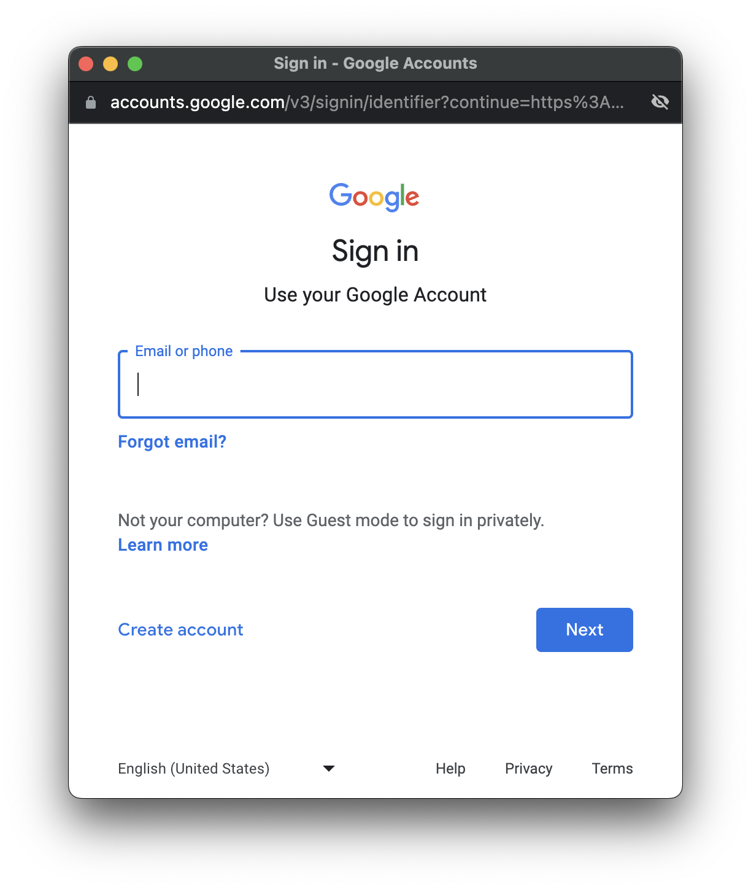

= Authorize All the Things with the Spring Authorization Server, OAuth, and Spring Boot
Josh Long <josh@joshlong.com>
:reproducible:
:listing-caption: Listing
:source-highlighter: rouge
:toc:

{author} loves the Spring Authorization Server, and want you to love it too.
Let's dive right into it.

== Introducing the Spring Authorization Server

Hi, Spring fans!
In this installment we're going to look at some patterns and practices for working with the Spring Authorization Server, and with OAuth in general in a Spring Boot-based system.

The Spring Authorization Server is one of my favorite new projects.
It's a full-blown OAuth identity provider (IDP), distributed as Spring Boot autoconfiguration.

The Spring Authorization Server is the final piece in the Spring Security OAuth's Ship of Theseus, the final replacement for a component in the built-in OAuth support in Spring Security 5 and later.
First there was OIDC client support, and then resource server support, and now - after a _lot_ of community outpouring and support - a brand new and fully featured OAuth IDP.

Why not use Keycloak, Okta, Auth0, ActiveDirectory, or something, I hear you ask? And the answer is.. be our guest! 99% of the stuff we're going to look at here works with any OAuth IDP. But i do so love the Spring Authorization Server. I don't know an easier way to get as configurable and flexible IDP up-and-running.

Having an easy component for your IDP integration is _liberating_.
If nothing else, it's one less `users` microservice for you to build.
But, at its best, it's a unifying force for your organization's notions of identity and policy, all centralized. If you implement it correctly, it's one less `users` microservice for _all_ of your systems, not just the one you're working on now!

It's Spring, so it of course supports the new-and-novel, but it's also built like all Spring Boot autoconfiguration, with hooks and customization in mind at every step.

I love it and I love it for helping me to love OAuth. If you only knew the agony I've been subjected to in learning and welding OAuth over the years, then you'll know what a thing that is for me to say. And I want you, dear reader, to love OAuth. And the way to do that is to, basically, _not_ care about OAuth.

And so we're going to take a journey to production together, with the Spring Authorization Server at our backs, and learn how to wield OAuth (via the amazing Spring Authorization Server) for some common kinds of patterns.

== The Journey Ahead

We're going to do a breadth-first not depth-first approach to using the Spring Authorization Server, so we're going to look at several pieces. By the end of this, we'll have explored:

* a Spring Authorization Server instance (called `authorization-server`)
* a backend HTTP API protected by Spring Security's OAuth 2 Resource Server capability (called `api`)
* a headless RabbitMQ-powered microservice whose request handling is done with Spring Integration, and protected by Spring Security's OAuth 2 Resource Server capability, _sort of_. (called `processor`)
* a static JavaScript application. I hesitate to even call it an application. It's one page, `index.html` (called `static`)
* a Spring Cloud Gateway instance that's acting as an OAuth 2 token relay and OAuth 2 client, originating new OAuth 2 tokens if they're not present and then forwarding requests onward to the backend HTTP API and static JavaScript assets with the token in tow.

We'll start first with the main event, the Spring Authorization Server. Arguably, everything _after_ that section would work equally well with any other OAuth 2 identity provider (IDP). But maybe you'll see in reading this section that you don't _need_ any other OAuth 2 identity provider any more. Either way, read on!

== Try it out!

Now, before we get ahead of ourselves, let's try it out!
Grab (`git clone`) the https://github.com/spring-tips/spring-authorization-server[code here] to follow along.

* in the root folder of the code, run `docker compose up`
* in `authorization-service`, run `run.sh`
* in `gateway`, run `run.sh`
* in `api`, run `run.sh`
* in `processor`, run `run.sh`
* in `static`, run `run.sh`
* visit `http://127.0.0.1:8082` (important: use the IP, _not_ `localhost`!) in the browser.
* login with `jlong`/`password` (yes, I know it's a terrible password, don't `@` me!), and then consent when prompted.
* you'll see a list of customers, click on the `email` button to kick off work in the `processor`. You should see indications in the console that your message has been sent.

There are lots of moving parts, but here's what you need to know: we have a JavaScript/HTML 5 client, a backend HTTP API, and a headless backoffice process, all of which have been secured with the Spring Authorization Server.

Shut everything down, and we'll start from scratch.

Refreshingly simple. Let's dive right into the nitty-gritty. I want you building secure systems by the article's end. My goal here is not to cover _every_ possible use case, but to cover some of the typical use-cases and introduce progressively more moving parts so that, if at some point you don't see what you need, you know where to reach you to build it yourself.

== Docker Compose and our Middleware

I know I just told you to shut everything down, but you need to restart one thing: the Docker images for both PostgreSQL and RabbitMQ. I've described all of their configuration in a `docker-compose.yml` file in the root of this project. It looks like this.

[source,yaml]
-----
include::docker-compose.yml[]
-----

We'll be connecting to either or both of the Docker images across many different services, so let's start them up before we proceed.

Go to the root of the project.

[source,shell]
----
docker compose up
----

RabbitMQ will be running on the usual port and have a user, `user`, and a password, `password`. PostgresSQL will be running on the usual port with the user `postgres`, schema called `postgres`, and the password `postgres`. Yes, I know these are terrible passwords...

== Stand up a Spring Authorization Server Instance for Great Good

Go to the https://start.spring.io[Spring Initializr (start.spring.io)], specify a group ID and an artifact ID (I chose `bootiful` : `authorization-server`) and add  `OAuth2 Authorization Server` as a dependency. I'd add `GraalVM Native Support` for good measure, but you do you. Open the downloaded project in your IDE. I'm using IntelliJ IDEA, but again, you do you. I ran the following command from the root of the newly unzipped archive: `idea build.gradle`.

You've got a new Spring Boot Authorization Server.
We need to specify two things: *users*, and *clients*.

=== Users

Users are pretty straight forward, right? A user is the sum of the username, password, and associated information attached to the systems' notion of identity. The beating heart of our system.

There are a lot of ways to get this done. The easiest might be to just have one user, the _default_ user, which you can describe using Spring Boot's associated properties, like this:

[source,properties]
----
include::authorization-server/snippets/default-user.properties[]
----

This gets us off the ground, but as soon as you want two or more users, you'll need to specify them a different way. The easiest is probably to define a bean of type   `InMemoryUserDetailsManager`, like this.

[code,java]
----
include::./authorization-server/snippets/UserDetailsConfiguration.java[]
----

Thus configured we've got two users:

* `jlong` with password `password` and roles `USER`
* `rwinch` with password `p@ssw0rd` and roles `USER` and `ADMIN`

This implementation is fine for development as it's all in-memory.
In a production system, you'll probably want something more durable.
We'll look at those possibilities in a bit.

=== OAuth Clients

An OAuth client defines how a program or process interacts with an OAuth IDP (like Spring Authorization Server).
Clients correspond more or less to the programs that would like to be allowed to authenticate on behalf of users.

I have tried to conceive of a clear illustration of clients in a vacuum, but it's not easy. so let's examine a real life example: you stumble upon some website, say https://www.yelp.com/[Yelp], a website that lets you contribute and read reviews about locations - restaurants, businesses, tourist spots, etc.
You want to login to see your history.
You _could_ create a new account there, going through the whole sign up flow and entering redundant information, but this information could soon become stale.
Maybe you change house or email address, or whatever, and you've forgotten to go back to the site and change your information.
Yelp know this, so they offer another path forward: `Continue with Google` and `Continue with Apple`.

image::images/yelp-signup.png[]

Click the button and another window on Google or Apple's sites pop up.

You know what to do here: you're in familiar territory.
It's google.com!
You know Google.
And Google _definitely_  knows you!
You've got an account here, you maintain that account, and you like that account.
You use it for your daily email, after all.
You've even got that reassuring little padlock icon in the browser's location bar giving you the warm-n-fuzzies about this site's authenticity: it is who it claims to be.
So you enter your information, login, and you have to whatever mutli-factor auth things Google wants you to do.

image::images/google-mfa.png[]

This shows up as a prompt on a completely different device, an iPad.

image::images/google-is-it-you.png[]

You've approved of the login, so that Google knows it really is you logging in, and now it's got to make sure you realize you're handing over some of the data associated with your identity to this new website, Yelp.com, so it throws up a consent form.

image::images/google-consent-screen.png[]

You click `Confirm` and then are finally logged in, with your Google identity, on Yelp.com

image::images/yelp-logged-in-with-google-part-2.png[]

At the end of this dance, Google.com transmitted a _token_ to the application running at Yelp.com.
Armed with this, the application running at Yelp.com can now transmit requests to the Google.com APIs, asking it questions about you, like your email.
It might also be able to read your Google calendar events, location data, etc.
What precisely the application at Yelp.com has access to is a function of the _scopes_ requested by the client.
The application at Yelp.com stores the token and uses it to interact with Google on your behalf.
Occasionally, Google.com will expire the token.
Tokens, like milk, go stale!
No worries: the application at Yelp.com has a _refresh_ token it can use to refresh the token and get a new one.

You're glad you signed up at Yelp.com, but look at the time, it's noon, the sun's out and the kid wants to go play mini golf at the place you just found on Yelp.com.
Gotta go!

Time passes, and you return to Yelp.com a week later.
By this point, Yelp.com's expired your HTTP session, and you're logged out.
No problem.
Click the `Continue with Google` button again, and this time you'll just be dumped into Yelp.com, fully authenticated.
Both Google and Yelp remember who you are and so there's no ceremony this time.
You got fast-path'd into an authenticated HTTP session on Yelp.com.
Thus: OAuth is invaluable both for establishing a new account and for subsequently logging into it.
You may have changed your home address on Google.com in the meantime, and now Yelp.com can see the new address information and offer you updated recommendations, too.
So Yelp.com is kept up-to-date and all you had to do was keep Google.com up-to-date.

From the perspective of Google, Yelp.com is an OAuth client.
All the particulars of how you went through that authentication flow - whether you needed to be redirected to Google.com, whether you should be shown a consent form, and what data Yelp.com was allowed to read from the Google.com API once it had a token stemming from this authentication flow, was governed by how the developers at Yelp.com registered their client with Google.

Clients must stipulate a client ID, and a client secret.
The client Id and client secret are transmitted in the request initiating the authentication flow, signalling to Google that Yelp.com is making this request.
Clients also stipulate what _scopes_ they want.
A scope is OAuth's version of rights, permissions, authorities, or claims.
They're (basically) arbitrary strings that mean something to Google.com's API.

There is one scope, `openid`, which is part of the OIDC specification.
This scope means that you want to log in as a user with the OAuth flow.
This is a sort of special case; Yelp.com may not want to read Google Calendar data, or read your email.
Those scopes would necessarily be unique to Google's APIs.
But signing a user into a site is a common enough thing and one that can be implemented usefully across all sorts of OAuth providers, so there's a specification called OpenID Connect (OIDC), that builds on top of OAuth 2.0, prescribing standard scopes and , importantly, standard APIs by which a client may look up information associated with a user.
Yelp.com might only just need enough information from Google.com to fill out a signup form for us: name, email, etc.
In that case, it would just specify `openid` as a scope and call it good.
In this way the Yelp.com client could even reuse the same code across other OIDC compliant providers, changing only the client ID and client secret and the issuer URI (the API's root URL).
Neat-o!

So, if you built a backoffice process, you'd register a client for that backoffice process.
If you built a new web application that you intend to support automatic sign-in with OAuth, you'd register a new client for that web application.

The simplest way to register clients in the Spring Authorization Server is to use properties in the `application.properties` or `application.yaml` file, like in this `application.yaml` example:

[source,yaml]
----
include::authorization-server/snippets/registered-clients.yaml[]
----

<1> you can use the https://docs.spring.io/spring-boot/docs/current/reference/html/cli.html[`spring`] CLI to encode a password for the client secret: `spring encodepassword BLAH`, where `BLAH` is the string you want to encode.
In our case, the client ID is `crm` and the client secret is `crm`.
(Again, I _know_ it's a terrible password.
Don't `@` me!).
NB: For complex strings like this, YAML parsing rules can be problematic, so I tend to wrap these things in quotation marks.
<2> `authorization-grant-types` refers to the use case - web application, mobile, headless backoffice application, etc. - for the authentication flow. https://oauth.net/2/grant-types/[OAuth 2.0 is nothing if not flexible].
<3> we're building a web application so the expectation is that, once you've authenticated yourself with the Spring Authorization Server, it'll redirect you back to the web application with the token in tow.
But where?
You specify that here.
We haven't looked at the application yet, so this is a bit of foreshadowing, but the redirect URI specified here is designed to line up with Spring Security's OAuth client support, which we'll use on the web application.
<4> Here we specify which scopes we'd like to be given.
We've seen `openid` before, and the other two are arbitrary, and just for demonstration.

At this point, we have a valid Spring Authorization Server, and you're ready to start using it!
Run the application in the usual way: `./gradlew bootRun` or `./mvnw spring-boot:run` or just run the main method from your IDE.
Congratulations on your first deployment of the Spring Authorization Server.
We _could_ stop here, satisfied that we have got _something_ to allow us to handle development chores and start building services.
Indeed, if you want to, you can skip ahead and things should work fine.

Eventually, however, you're going to realize you can't leave things as they are - you'll need durable state.
As-is, everything is kept in-memory.
It's obviously non-starter to need to deploy a new Spring Authorization Server every time you add a new client, user, or otherwise.
People will want self-service forms by which they can register new users, clients, etc.
All existing OAuth tokens would become invalid once you restart the Spring Authorization Server, too!
Indeed, all state related to any successful OAuth authorizations would be forgotten on every restart.
The situation's not good, and in the next section, we're going to look at introducing persistence, with JDBC, to get around it.

If you want to carry on using property files, then perhaps consider the Spring Cloud Config Server.
It's another piece of Spring Boot-powered middleware that, once stood up, mediates access to configuration files via an HTTP API.
The configuration files live in a version control system, like Git, which the Spring Cloud Config Server monitors.
When the files change, the Spring Cloud Config Server serves up the new configuration data.
Even better, the Spring Cloud Config Server can, via the Spring Cloud Bus abstraction, publish notifications to your microservices (like the Spring Authorization Server) on an event bus like RabbitMQ or Apache Kafka so that you can automatically reload the new configuration.
This works particularly well in tandem with the Spring Cloud's `@RefreshScope`.
In such a configuration, the configuration for everything still lives in a `.properties` or `.yaml` file, as it does now, but the files are centralized and can be changed without reloading the Spring Authorization Server.
Storing files in a version control system gives us niceties like versioning, auditing, rollbacks, etc., for very sensitive configuration data.
And, going a step further, you can even use the Spring Authorization Server to store data encrypted at rest.
For more on these possibilities, check out this https://www.youtube.com/watch?v=aC_siBP8rx8&list=PLgGXSWYM2FpPw8rV0tZoMiJYSCiLhPnOc&index=31[video I did some years ago].
And _all_ of these possibilities are enabled entirely because the Spring Authorization Server is delivered as just another Spring Boot autoconfiguration!

=== Persistence with PostgreSQL and JDBC

Spring makes it easy to substitute implementations with polymorphism.  _Dependency injection_ is one of the key reasons we use Spring.
Spring Boot-based configuration makes this doubly powerful.
While the Spring Authorization Server does amazing things out of the box, its real power lay in all the knobs and leavers available to you because it's just another Spring Boot autoconfiguration.
We have already acknowledged that keys parts of the Spring Authorization Server defer to in-memory implementations.
In this section, we'll swap those, and more, out for implementations using JDBC.
We'll use JDBC, but these are just interfaces.
If you don't want to use JDBC, then feel free to implement the interfaces for yourself, deferring to whatever underlying storage mechanism you want.
Spring Data is your friend...

Before we can get started, we'll need a PostgreSQL database.
Some place in which to store our state.
In the root of the project, run `docker compose up`.

Now, we're going to need to retool our project to accomodate JDBC, so add the following dependencies to the Gradle build:

[source,groovy]
----
	runtimeOnly 'org.postgresql:postgresql'
	implementation 'org.springframework.boot:spring-boot-starter-jdbc'
----

Modify `application.properties` or `application.yaml` to point to the newly configured PostgreSQL database with username, schema, and password all set to `postgres`.
(Sigh.
I can feel Spring Security lead Rob Winch staring at me disapprovingly because of my terribad passwords: I'm trying to demonstrate something here!) Here's the relevant configuration for `application.properties`.

[source,properties]
----
spring.datasource.url=jdbc:postgresql://localhost/postgres
spring.datasource.username=postgres
spring.datasource.password=postgres
# <1>
spring.sql.init.mode=always
# <2>
spring.sql.init.schema-locations=classpath:sql/schema/*sql
# <3>
spring.sql.init.data-locations=classpath:sql/data/*sql
----

<1> This tells Spring Boot to initialize the SQL database with the schema in `src/main/resources/schema.sql` and `src/main/resources/data.sql`.
Be sure to disable this property in production!
<2> This tells Spring Boot to not use `schema.sql` specifically, but to instead use _all_ `.sql` files in `src/main/resources/sql/schema/`.
This way, we can keep the various DDL statements separate.
<3> This tells Spring Boot to not use `data.sql` specifically, but to instead use _all_ `.sql` files in `src/main/resources/sql/data/`.
This way, we can keep the inserts separate.

==== A Brief Note on Passwords

Every time you see a password in the source code of these programs, remember, this is a _demonstration_.
There are a million ways to externalize usernames and passwords from the source code and that's going to be up to you to figure out.
Every time you see a password, you should tell yourself: that _should've been at the very least an environment variable_!
You shouldn't see passwords in `.sql` files, `.yaml`, `.properties`, and especially not in `.java` source code on Github.
There are far better solutions including the Spring Cloud Config Server and the Spring Cloud Vault integration.

Also, we're going to need to encode passwords so that they're not lying around at rest in plain text.
Define a bean of type `PasswordEncoder` for use in your program.

[source,java]
-----
include::authorization-server/src/main/java/bootiful/authorizationserver/SecurityConfiguration.java[]
-----

<1> this is a sort of compose `PasswordEncoder`, checking the prefix of the password string for information as to which encoder to use.
We've already seen it action.
The `spring encodepassword`  CLI command produces a string that starts with `{bcrypt}...`.
The default for Spring Security, today, as of this writing, is to use BCrypt.
But that may change, and when the default changes, existing passwords will continue to work because the `PasswordEncoder` will know to look for the prefix and use the older BCrypt encoder when dealing with those older passwords.

We'll use the `PasswordEncoder` more later.

==== Users

There are other implementations of the `UserDetailsService` interface that you can use to persist users durably.
Thinking from a more operational perspective, it's possible you'd want to dynamically register users dynamically, rather than having to restart the Spring Authorization Server instance after you've updated the source code.
Spring Security has an extension of the `UserDetailsService` interface called `UserDetailsManager` which gives you explicit control over the lifecycle of `UserDetails`: adding, updating, deleting, etc.
And, as you might imagine, there's a persistent implementation of this interface called `JdbcUserDetailsManager` that uses JDBC.

You'll need to install some SQL schema first.
Spring Security ships with some usable schema on the classpath, but unfortunately it doesn't work with PostgreSQL, and it's going to fail if there are already table definitions.
So we'll modify it accordingly, as shown in `src/main/resources/sql/schema/users.sql`.

[source,sql]
-----
include::authorization-server/src/main/resources/sql/schema/users.sql[]
-----

We could also define the users with SQL in a file under the `sql/data/` folder, but I want you to see what it looks like to use the Java API to programmatically register a user, so here is both the `UserDetailsService` registration and a bean that uses the `UserDetailsService` to write some data to the database.

[source,java]
-----
include::authorization-server/src/main/java/bootiful/authorizationserver/UsersConfiguration.java[]
-----

<1> this is a convenient pattern: define the prototype for all new users once and then reuse the builder
<2> Poor Rob Winch's eyes! why are there passwords just strewn about our Java source code?
Remember what we talked about earlier: don't do this in production code!

==== Clients

The `RegisteredClientRepository` interface is trivial and lends itself to implementation with a persistent store.

It's easy enough to do that here, too, with implementations of the `RegisteredClientRepository`.
There's an implementation called `JdbcRegisteredClientRepository` that uses JDBC to manage registered clients.
It would be a fairly trivial project to implement alternatives using other persistence mechanisms like MongoDB or Hashicorp Vault.

The obvious advantage of a `RegisteredClientRepository` backed by a persistent store is that you could build a self-service registration form (or workflow) - just like Google and Apple do - for your organizations developers to register clients on demand without having to restart anything or manipulate source code.

There's some schema on the classpath (`classpath:org/springframework/security/oauth2/server/authorization/client/oauth2-registered-client-schema.sql`) for the implementation that we need to take care to install first.
We could tell Spring Boot to run this directly, but the trouble is that it'll fail on the second run when it executes the same DDL statements and experiences a conflict trying to create something that's already there.
Create a new file `src/main/resources/sql/schema/oauth2-registered-client.sql` and use this DDL instead.

[source,sql]
----
include::authorization-server/src/main/resources/sql/schema/oauth2-registered-client.sql[]
----

And here's the definition of the `RegisteredClientRepository` and a runner that uses it to install a client, more or less identical to the client we registered earlier in `application.properties`.

[source,java]
-----
include::authorization-server/src/main/java/bootiful/authorizationserver/ClientsConfiguration.java[]
-----

<1> register the `RegisteredClientRepository`
<2> this installs a registered client that's more or less equivalent to what we saw earlier in the `application.yml` properties file.

==== Authorizations

Remember that bit where you got redirected to the Spring Authorization Server and had to click a checkbox to confirm that the user had `user.read` scope?
That fact - the consent of the scope - is stored in memory by default, but it could be stored in a database too.
(Big surprise, I know!)

There are two interfaces of note here: `OAuth2AuthorizationService` and `OAuth2AuthorizationConsentService`.

`OAuth2AuthorizationService` handles representations of an authorization - the JWT token, the client, etc.
It's the same story as before: there's schema on the classpath (`org/springframework/security/oauth2/server/authorization/oauth2-authorization-schema.sql`) but it doesn't work with PostgresSQL and, importantly, even if it did it would fail on the second run through because Spring Boot would try to define the table twice, in effect.
So we'll modify it.
Create a file `src/main/resources/sql/schema/oauth2-authorization-schema.sql`.
The changes we've made replace all `blob` types with `text`.

[source,sql]
-----
include::authorization-server/src/main/resources/sql/schema/oauth2-authorization-schema.sql[]
-----

`OAuth2AuthorizationConsentService` handles representations of an OAuth 2.0 "consent" to an Authorization request, which holds state related to the set of authorities granted to a client by the resource owner.
It's the same story as before: there's schema on the classpath (`org/springframework/security/oauth2/server/authorization/oauth2-authorization-consent-schema.sql`) but it doesn't work with PostgresSQL and, importantly, even if it did it would fail on the second run through because Spring Boot would try to define the table twice, in effect.
So we'll modify it. Create a file `src/main/resources/sql/schema/oauth2-authorization-consent-schema.sql`.
The changes we've made replace all `blob` types with `text`.

[source,sql]
-----
include::authorization-server/src/main/resources/sql/schema/oauth2-authorization-consent-schema.sql[]
-----

==== The HTTP Sessions themselves

The final piece of the persistence pie is to persist the actual HTTP sessions themselves. Spring Authorization Server assumes a Servlet container is present somewhere. By default, Spring Boot uses Apache Tomcat, though that's very configurable. And Apache Tomcat, in turn, provides session management features consistent with the HTTP Servlet specification. It's even got pluggable HTTP session management, meaning you can plugin other implementations of Apache Tomcat's proprietary abstraction. But this isn't easy, or portable. Indeed, any web server is going to have some rudimentary HTTP session management, but session clustering and replication, consistency checks, etc., are not their _raison d'être: serving HTTP requests is.

Spring Session can help. It wraps the containers' default `HttpSession`. All interactions you have pass through the wrapper, which in turn delegates to any of a number of implementations backed by technology that is far faster and more reliable in the ways of making data consistently available.You can use implementations for, among other things, Hazelcast, Redis, and of course any 'ol SQL `DataSource`. We're choosing to continue to leverage our investment in PostgreSQL, so we'll use the Spring Session JDBC module.

Add the following dependency to the build:

[source,groovy]
----
	implementation 'org.springframework.session:spring-session-jdbc'
----

There is a property, `spring.session.jdbc.initialize-schema=always`, that once specified will cause Spring Session to install the JDBC schema for you in the database. It worked for me (surprise!), in PostgreSQL. But, I just really want the schema to all be in one place where I can version control it, audit it, etc, so here's the schema. Create a file `src/main/resources/sql/schema/spring-session-jdbc.sql`.

[source,sql]
-----
include::authorization-server/src/main/resources/sql/schema/spring-session-jdbc.sql[]
-----

And that's it!  Restart the Spring Authorization Server. Now you can run more than one instance of the Spring Authorization Server behind a load balancer, and no matter to which instance a client and its cookies present themselves, the container will resolve the session from the PostgreSQL database. By the way, is now a good time to remind you not to stash sensitive stuff in the HTTP session? You never know when it's going to be serialized to some datastore...

== Protecting a Simple HTTP API

Let's build an HTTP API. Honestly, this is just a pretense to have something to secure with the Spring Security OAuth support, so we'll make this quick. First, go to the https://start.spring.io[Spring Initializr], and then add the following dependencies: `

* `Spring for RabbitMQ`
* `Spring Integration`
* `Spring Web`
* `OAuth2 Resource Server`
* `Spring Data JDBC`
* `PostgreSQL Driver`

I gave the newly minted project a group of `bootiful` and named it `api`. Click `Generate`, unzip the newly minted `.zip` file, and then open the project in your IDE.

The domain's a trivial one: customer data, like a CRM. Each `Customer` entity has an `id` field, a `name` field, and an `email`.

[source,java]
-----
include::api/src/main/java/bootiful/api/Customer.java[]
-----

And of course there's a Spring Data JDBC repository to make working with that data easier...

[source,java]
-----
include::api/src/main/java/bootiful/api/CustomerRepository.java[]
-----

And an HTTP controller that will return all that customer data...

[source,java]
-----
include::api/src/main/java/bootiful/api/CustomerHttpController.java[]
-----

Remember we're going to be securing this with Spring Security's OAuth support, and just to be sure everything's worked, we'll have a simple HTTP endpoint that injects and then spits out the current authenticated user's username (so you can see who the system thinks is authenticated at the moment).

[source,java]
-----
include::api/src/main/java/bootiful/api/MeHttpController.java[]
-----

And, finally, we've got a little integration that sends a message using the AMQP protocol via RabbitMQ to another service called `processor`. We'll introduce that thing later. The idea is that you'll be able to click a button to get some sort of email sent to each user. I haven't really thought out what sort of email. Just use your imagination. Sending email is one of those things you don't necessarily want to do in the hot path of handling HTTP requests. It takes a while, is prone to failing for no good reason, etc. It's one of those things that might also scale independently of the HTTP API itself, so we've put it on the other end of a message queue.

TIP: This is what we used to call a backoffice process. I'm calling it `processor`, because I'm amazing with names, like everyone on the Spring team is. We named our MVC framework Spring MVC, our data framework Spring Data, our Batch framework Spring Batch.. well, you get the idea. (Don't ask about Spring Boot, tho!)

Requests originate here in this controller. Each request contains a `Customer` payload, and header, `jwt`, which contains the JWT associated with the current authenticated user. We'll use that JWT later to validate the request is from a trusted, authenticated, user.

[source,java]
-----
include::api/src/main/java/bootiful/api/EmailController.java[]
-----

And there's a bit of Spring Integration plumbing to route those requests to our RabbitMQ broker running in a separate process. This `IntegrationFlow` looks at requests (which come in the shape of a `Message<T>` object, which has headers and a payload) coming in from the injected `MessageChannel`, transforms them into JSON data, and then sends them, along with a JWT token associated to the current authenticated user, on to the broker, where it'll eventually get delivered to the consumer, `processor`.

[source,java]
-----
include::api/src/main/java/bootiful/api/EmailRequestsIntegrationFlowConfiguration.java[]
-----
<1> inbound adapters translate events from the real world into Spring Framework `Message<T>` objects. Outbound adapters translate `Message<T>` objects into events in the real world. This adapter lets us interface with RabbitMQ via the AMQP protocol.
<2> In this case, messages pass through the `MessageChannel`...
<3> ...and into the next stage in the flow, a transformer, which will translate the `Message<Customer>` into a `Message<String>`, with a JSON payload
<4> and from there, it gets routed to the outbound AMQP adapter, which will translate the Spring Framework `Message<String>` into a request sent over AMQP to the RabbitMQ broker

We're using Spring Security's Resource Server support to protect requests to the API, rejecting requests that don't have a valid OAuth 2 token. It does this by connecting to the OAuth 2 IDP (our amazing Spring Authorization Server instance) and validating the JWT.

The Spring Security Resource Server support, the Spring Data support, the Spring Integration AMQP support, all of it requires configuration, which brings us to our `application.properties`:

[source,properties]
----
include::api/src/main/resources/application.properties[]
----
<1> the issuer URI is the address of the Spring Authorization Server against which Spring Security can validate a JWT token
<2> we need to connect to the RabbitMQ instance..
<3> and the PostgresSQL database...
<4> the Spring Authorization Server is already running on port `8080`, so we'll need to run this Java application on port `8081`. (Remember that!)

